# 数据结构

==目录如下==

[toc]

开始啦！！！

## 第一章

### 1.1前要

初步理解为是数据元素是结构体，而数据项是结构体成员

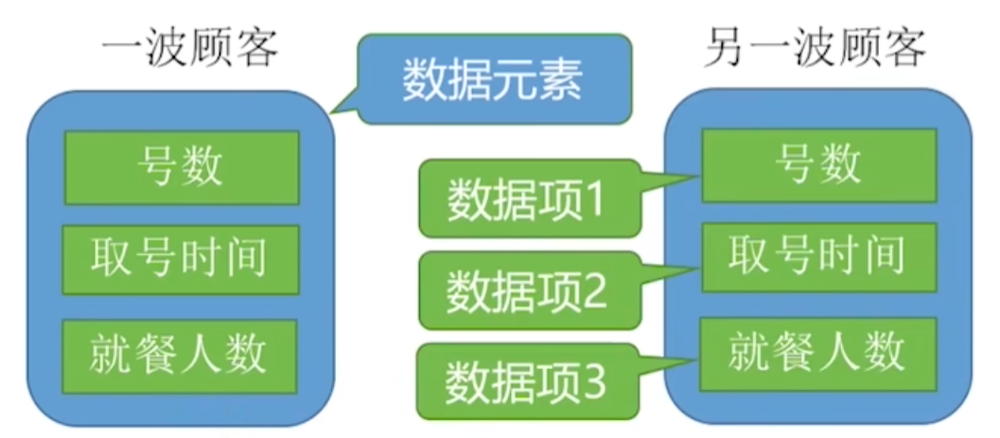

数据结构和数据对象的概念

数据结构是数据元素之间的关系集合

数据对象是有相同性质的数据元素的集合

抽象数据类型-----定义了数据的取值范围和结构

##### 三要素

###### 逻辑结构

* 集合

集合内并无其他联系

* 线性结构

一对一，一个连一个

* 树形结构

一对多的关系

* 图状结构

多对多，网状结构

###### 物理结构

也叫存储结构

* 顺序存储

==逻辑相邻，存储相邻==

* 链式存储

逻辑相邻，存储可不临，借助指针

* 索引存储

* 散列存储

又叫哈希存储，根据关键字直接计算出存储地址

###### 数据的运算

### 1.2算法

* 理解 数据结构是食材，算法就是做菜的步骤

* 特性：1有穷性（在一定时间内完成） 2确定性（相同输入对应相同输出） 3可行性（能用代码实现）4输入 5输出

* 好的算法具备：:one:正确 :two:可读:three:健壮（对于一些特殊情况页可以应对）:four:高效率 低储存量​


#### 时间复杂度

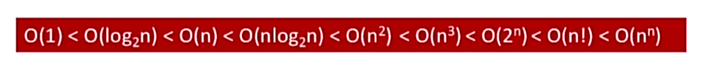  

常数，对数，线性，线性对数，平方，立方，指数，阶乘，幂指

1.加法保留最高级（数量级），用大O记

2.顺序执行的代码可以忽略他的时间复杂度，只用看循环和n的关系

3.多层嵌套的话 只需关注**最深层**循环了几次

遇到分支语句 考虑最坏的情况-----执行次数最多的分支

#### 空间复杂度

算法的**空间复杂度**中的 O(1) 表示 “常数空间复杂度”，其核心含义是：算法运行所需的**辅助空间**（即除了输入数据外额外使用的空间）是一个固定的常数，与问题规模 n 无关

递归求时间复杂度

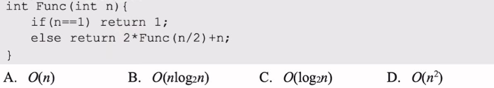

当 n=1 时，时间复杂度 T(1)=O(1)；

当 n>1 时，递归调用 Func(n/2)，递推式为：T(n)=T(n/2)+O(1)

只调用了一次t（n/2)不用看系数

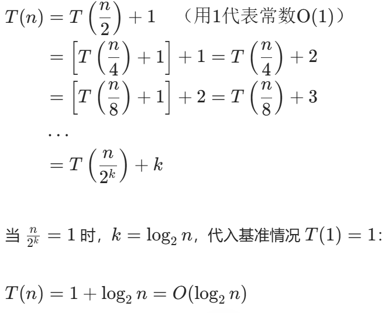

如果变成这样

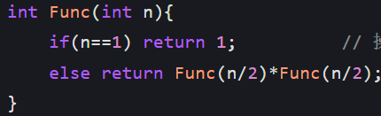

这里调用了两次，所以T(n) = 2·T(n/2) + 1

+1是因为常数时间操作 （if判断，乘法运算 函数返回）

展开后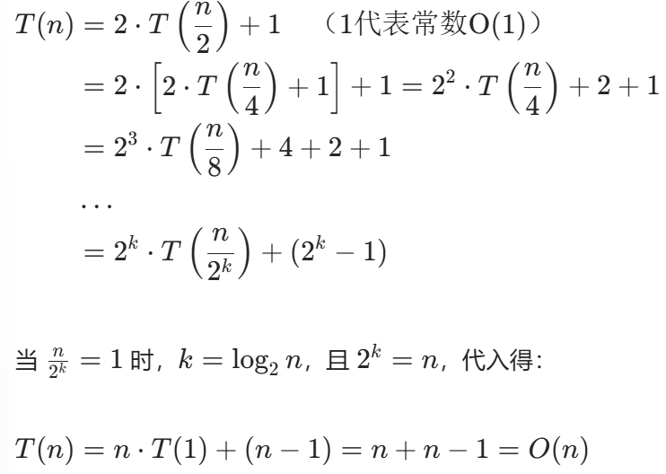


## 第二章

### 2.1线性表

定义：**相同数据类型**的**有限**n个数据元素**序列**，n是表长，n=0时时一个空表

位序从1开始，而索引从0开始

### 2.2线性表的物理结构---顺序表（顺序储存

定义:**连续的内存空间**存储数据的线性结构

- **静态分配**：存储空间在编译时就固定大小，无法扩容；
- **动态分配**：存储空间在程序运行时申请，且可以根据需要动态扩容。

顺序表的基本操作

1. 插入-----数据前移后移
2. 删除-----静态分配系统自动回收，动态分配使用free
3. 查找

### 2.3线性表的物理结构---链表（链式储存


#### 单链表

##### 定义

链表的节点用结构体实现，同时储存数据和指针

```c
strust Node{
  int data;--------数据域
  struct Node*next;-----------指针域
}
struct Node*p=(struct Node*)malloc(sizeof(struct Node));
```

最后一个节点的next是NULL

这样子有一些麻烦，所以可以使用typedef如下--------[typedef的用法](typedef的使用)

```c
typedef struct Node{
     int data;
     struct Node*next;
}Node,*LinkList;
```

Node*强调的是一个节点，LinkList强调的是整个单链表

##### 初始化

###### 裸头指针

要修改链表本身，必须传入二级指针

```c
void InitList(LinkList* L)
{
     L=NULL;---空链表
}
int main()
{
     LinkList L;
     InitList(L);
}
```

###### 哨兵节点

```c
void InitList(LinkList*head)
{
     *head=(Node*)malloc(sizeof(Node));//分配一个头节点，直接操作原头节点指针
     if(head==NULL)exit(1);//内存不足就退出
     head->next=NULL;//只有头节点
}
int main()
{
     LinkList head;
     InitList (head);
}
```

空链表判断

哨兵节点——if(L->next==NULL)

不带头节点——————if(L==NULL)

##### 插入

带头节点,若pos=2,head的位置是i=0

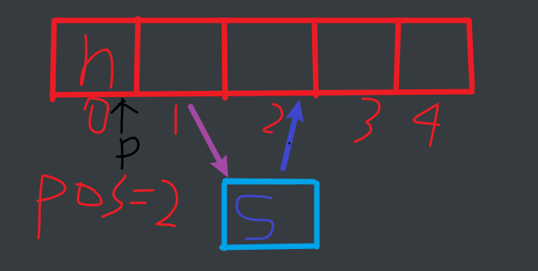

```c
int List-insert(Node* head,int pos,int value)//head是头指针，pos是要插入的位置，value是插入节点的数据data
{
     if(pos<1)return 0;
     Node*p=head;
     int i=0;
     while(p&&i<pos){p=p->next;i++}//将p移动到pos前一个位置
     if(!p)return 0;
     Node*s=(Node*)malloc(sizeof(Node);
     if(!s)return 0;
     s->data=value;
     s->next=p->next;
     p->next=s;
     return 1;
}
```

不带头节点

```c
int List-insert(Node*L,int pos,int value)
{
     if(pos<0)return L;
     Node*s=(Node*)malloc(sizeof(Node));
     if(!s)return L;
     s->data=value;
     if(pos==0)//插入最前面
     {
          s-next=L;
          return s;//新的头节点
     }
     Node *p=L;
     int i=0;
     while(p&&i<pos-1){p=p->next;i++;}
     if(!p)
     {
          free(s);
          return L;
     }
     s->next=p->next;
     p->next=s;
     return head;
}
```

##### 删除

带头节点,或者是用复制数据给下一个这样子，使用free函数

```c
int ListDelete(LinkList head,int pos,int value)
{
     if(pos<1)return head;
     Node*p=head;
     int i=0;
     while(p&&i<pos-1)//找到pos前一个位置
     {
          p=p->next;
          i++;
     }
     if(p)return head;
     if(p->next)return  head;
     Node*q=p->next;//q指向要删除的那一个节点
     e=q->data;//返回删除节点的值
     p->next=q->next;
     free(q);//释放
     return e;
}
```


##### 查找--------依次查找

输入-1表示结束 ，详细可看7.2

##### 尾插法

👉 输入顺序：a b c
       👉 链表结果：a b c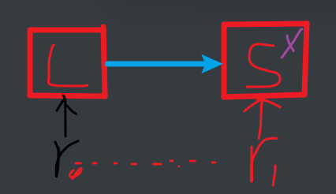

```c
LinkList TailInsert()
{
     LinkList L=(LinkList)malloc(sizeof(Node));
     L->next=NULL;//头节点，避免野指针
     Node*r=L;
     scanf("%d",&value);
     while(value!=-1)
     {
          Node*s=(Node*)malloc(sizeof(Node));
          s->data=e;
          r->next=s;
          r=s;
          scanf("%d",&value);
     }
     r->next-NULL;
     return L;
}
```


##### 头插法

👉 输入顺序：a b c
       👉 链表结果：c b a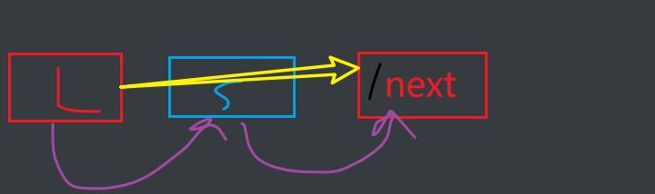

```c
LinkList HeadInsert()
{
     LinkList L=(LinkList)malloc(sizeof(Node));
     L->next=NULL;
     scanf("%d",&value);
     while(value!=-1)
     {
          Node*s=(Node*)malloc(sizeof(Node));
          s->data=value;
          s->next=L->next;
          L->next=s;
          scanf("%d",&value);
     }
     return L;


```

#### 双链表

双链表就是每个结点有两个指针的链表

prior是前驱结点，next是后驱结点

**定义**如下：

```c
typedef struct DNode
{
     int data;
     struct DNode *prior;
     struct DNode *next;
}DNode,*DLinkList;
```

**初始化**：

```c
void InitDLinkList(DLinkList* L)
{
     L=(DNode*)malloc(sizeof(DNode));
     if(L==NULL)exit(1);
     L->prior=NULL;
     L->next=NULL;
}
```

判断空链表---if（L->next==NULL）

**插入**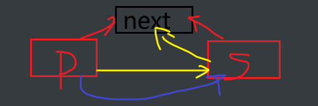

```c
void Insert(DNode *p,DNode*s)//p后插入s
{
     if(p==NULL||s==NULL)exit(1);
     s->next=p->next;
     if(p->next!=NULL)//如果p有后继结点
     p->next->prior=s;//先连接后面的
     s->prior=p;
     p->next=s;//再链接前面的
}
```

**删除**p的后继节点

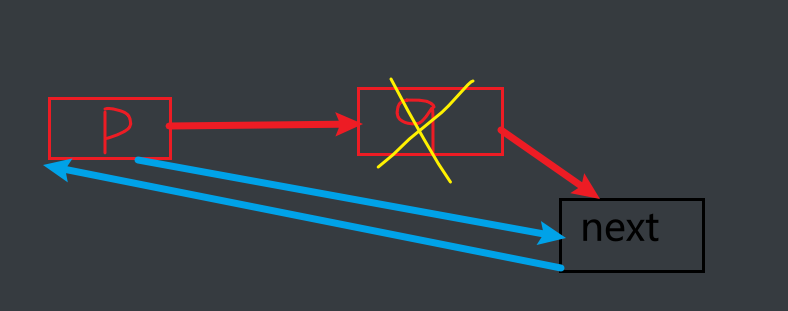

```c
void Delete(DNode*p)
{
     if(p==NULL)exit(1);
     DNode*q=p->next;
     if(q==NULL)exit(1);
     p->next=q->next;
     if(q->next!=NULL)
          q->next->prior=p;
     free(q);
}
```


#### 循环链表


**初始化**

```c
void InitList(LinkList*L)
{
     L=(LNode*)malloc(sizeof(LNode));
     if(L==NULL)exit(1);
     L->next =L;//重点就是最后一个节点指向第一个
}
```

判断为空：if(L->next ==L)

#### 静态链表

**静态链表**其实就是——👉 用“**数组”**模拟“链表”。

普通链表：

> 每个节点里存数据 + 指针（地址）

静态链表：

> 每个节点里存数据 + 下标（数组索引）

```c
typedef struct 
{
     int data;
     int index;
}space[100];
space[100]是一个有100个位置的struct类型数组
```

静态链表容量不可变，增加删除只需要改变游标，不能随机存取

#### 比较

[顺序表和链表的区别](顺序表和链表的区别.md)

## 第三章

### 3.1栈Stack

#### **定义**

栈是一种**受限**的**线性**数据结构，只允许在**同一端**进行插入和删除操作。//==最后放进去的，最先被取出来==

| 栈顶TOP    | 允许插入删除的一端 |
| ---------- | ------------------ |
| 栈底BOTTOM | 固定端             |
| 空栈       | 栈里没有任何元素   |
| 栈满       | 栈的存储空间满了   |


**基本操作**：1.入栈Push 2.出栈Pop 3.读栈顶Peek/Top 4.判空/判满isempty,isfull

n个不同元素进栈，出栈排列顺序有C^n^~2n~/（n+1）种

#### **顺序栈**

**定义初始化**

```c
typedef struct
{
     int data[maxsize];
     int top;//栈顶，第一次入栈等于0
}Stack;
void InitStack(Stack*s)
{s->top=-1;//空栈
}
```

**判断为空**

```c
int isEmpty(Stack*s)
{return s->top==-1;
}
```

**入栈**

```c
int push(Stack*s,int x)
{
     if(s->top==maxsize-1)return 0;//栈满，入栈失败
     s->data[++s->top]=x;
     return 1;//成功
}
```

**出栈**

```c
int pop(Stack*s,int *x)
{
     if(isEmpty(s))return 0;//栈空，出栈失败
     *x=s->data[s->top--];
     return 1;
}
```

**读栈顶**

```c
int peek(Stack*s,int*x)
{if(s->top==-1)return 0;//栈空
 *x=s->data[s->top];
 return 1;
}
```


#### **链式栈**

👉 **链式栈 = 用链表实现的栈**

##### 不带头结点

👉 **栈顶指针直接指向第一个数据结点**

```c
//定义
typedef struct StackNode{
     int data;
     struct StackNode*next;
}StackNOde;//栈里的一个结点
typedef struct{
     StackNode*top;//指向栈顶结点
}LinkStack;//定义整个栈
//初始化
void InitStack(LinkStack*s){//指向一个栈的指针
     s->top=NULL;
}
//判空
int isEmpty(LinkStack*s)
{
     return s->top==NULL;
}
//判满
int isFull(LinkStack*s){
     StackNode*p=(StackNode*)malloc(sizeof(StackNode));
     if(p==NULL)return 1;//内存不足，栈满
     free(p);
     return 0;
}
//入栈
int push(LinkStack*s,int x){
     StackNode*node=(StackNode*)malloc(sizeof(Stacknode));
     if(node==NULL)return 0;
     node->data=x;
     node->next=s->top;
     s->top=node;
     return 1;
}
//出栈
int pop(LinkStack*s,int *x){
     if(isEmpty(s))return 0;
     StackNOde*p=s->top;//保存栈顶地址
     *x=p->data;//解引用x，访问x指向地址里存储的值
     s->top=p->next;
     free(p);
     return 1;
}
//读栈顶
int peek(LinkStack*s,int*x){
     if(isEmpty(s))return 0;
     *x=s->top->data;
     return 1;
}
```

##### 带头结点

```c
//定义
typedef struct StackNode{
     int data;
     struct StackNode*next;
}StackNode;
typedef struct {
     StackNode*head;//头结点指针
}LinkSatck;
//初始化
void InitStack(LinkStack*s){
     s->head=(StackNode*)malloc(sizeof(StackNOde));
     s->head->nextNULL;
}
//判空
int isEmpty(LinkStack*s)
{
     return s->head->next==NULL;
}
//判满
int isFull(LinkStack*s){
     StackNode*p=(StackNode*)malloc(sizeof(StackNOde));
     if(p==NULL)return 1;
     free(p);
     return 0;
}
//入栈
int push(LinkStack*s,int x){
     StackNode*node=(StackNode*)malloc(sizeof(StackNode));
     if(node==NULL)return 0;
     node->data=x;
     node->next=s->head->next;
     s->head->next=node;
     return 1;
}
//出栈
int pop(LinkStack*s,int *x)
{
     if(isEmpty==NULL)return 0;
     StackNode *p=s->head->next;
     *x=p->data;
     s->head->next=p->next;
     free(p);
     return 1;
}
//读栈顶
int peek(LinkStack*s,int*x){
     if(isEmpty(s))return 0;
     *x=s->head->next->data;
     return 1;
}
```

### 3.2队列Queue

**先进先出（FIFO：First In First Out）**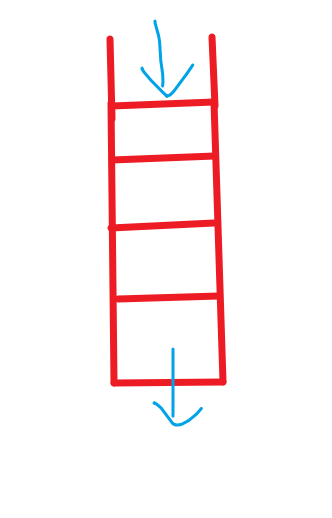

**队尾（rear）入队 **   **队头（front）出队**

| 操作      | 含义             |
| --------- | ---------------- |
| InitQueue | 初始化队列       |
| EnQueue   | 入队（从队尾）   |
| DeQueue   | 出队（从队头）   |
| GetHead   | 读队头元素       |
| IsEmpty   | 判空             |
| IsFull    | 判满（顺序队列） |

#### 顺序队列

##### 定义

```c
#define maxsize 100
typedef struct {
     int data[maxsize];
     int front;//类似数组
     int rear;
}CirQueue；//SqQueue
```

##### 初始化

```c
void initQueue(CirQueue*q){
     q->front=0;
     q->rear=0;
}
```

##### 判空

```c
int isEmpty(sqQueue*q){
     return q->front==q->rear;
}
```

##### 判满

```c
int isFull(sqQueue *q){
     return q->rear==maxzize;
}//没有留空位，假溢出
int isFull(cirQueue*q){
     return (q->rear+1)%maxsize==q->front;
}//留一个空位
```

##### 入队

```c
int enQueue(SqQueue *q, int x) {
    if (isFull(q))
        return 0;

    q->data[q->rear++] = x;
    return 1;
}
int enQueue(CirQueue *q, int x) {
    if (isFull(q))
        return 0;

    q->data[q->rear] = x;
    q->rear = (q->rear + 1) % MAXSIZE;
    return 1;
}

```

##### 出队

```c
int deQueue(SqQueue *q, int *x) {
    if (isEmpty(q))
        return 0;

    *x = q->data[q->front++];
    return 1;
}
int deQueue(CirQueue *q, int *x) {
    if (isEmpty(q))
        return 0;

    *x = q->data[q->front];
    q->front = (q->front + 1) % MAXSIZE;
    return 1;
}
```

##### 读对头

```c
int getFront(SqQueue *q, int *x) {
    if (isEmpty(q))
        return 0;

    *x = q->data[q->front];
    return 1;
}
```

#### 链式队列

**定义**

```c
typedef struct QNode {
    int data;
    struct QNode *next;
} QNode;
typedef struct {
    QNode *front;   
    QNode *rear;    
} LinkQueue;
```

**初始化**

```c
//不带头结点
void InitQueue(LinkQueue *q){
    q->front = q->rear = NULL;
}
//带头结点
void InitQueue(LinkQueue *q){
    q->front = q->rear = (QNode*)malloc(sizeof(QNode));
    q->front->next = NULL;
}
```

**判空**

```c
int IsEmpty(LinkQueue *q){
    return q->front == NULL;
}
int IsEmpty(LinkQueue *q){
    return q->front == q->rear;
    // 或 q->front->next == NULL
}
```

**入队**

```c
int EnQueue(LinkQueue *q, int x){
    QNode *node = (QNode*)malloc(sizeof(QNode));
    node->data = x;
    node->next = NULL;

    if(q->front == NULL){   // 第一个结点
        q->front = q->rear = node;
    }else{
        q->rear->next = node;
        q->rear = node;
    }
    return 1;
}
int EnQueue(LinkQueue *q, int x){
    QNode *node = (QNode*)malloc(sizeof(QNode));
    node->data = x;
    node->next = NULL;

    q->rear->next = node;
    q->rear = node;
    return 1;
}
```

**出队**

```c
int DeQueue(LinkQueue *q, int *x){
    if(q->front == NULL)
        return 0;

    QNode *p = q->front;
    *x = p->data;
    q->front = p->next;

    if(q->front == NULL)    // 删除最后一个结点
        q->rear = NULL;

    free(p);
    return 1;
}
int DeQueue(LinkQueue *q, int *x){
    if(q->front == q->rear)
        return 0;

    QNode *p = q->front->next;
    *x = p->data;
    q->front->next = p->next;

    if(q->rear == p)
        q->rear = q->front;

    free(p);
    return 1;
}
```

**读队头**

```c
int GetFront(LinkQueue *q, int *x){
    if(q->front == NULL)
        return 0;
    *x = q->front->data;
    return 1;
}
int GetFront(LinkQueue *q, int *x){
    if(q->front == q->rear)
        return 0;
    *x = q->front->next->data;
    return 1;
}
```

#### 双端队列

双端队列 = 两端都可以入队和出队的队列

输出序列的合法性判断

### 3.3应用

- 括号匹配
- 用栈实现表达式的运算（中转后左优先，中转前右优先

#### 1）中缀转后缀（用运算符栈）

- 遇到 **数字**：直接输出
- 遇到 **左括号 '('**：入栈
- 遇到 **右括号 ')'**：一直弹栈输出，直到弹出 '('
- 遇到 **运算符**：
  - 栈顶运算符优先级 ≥ 当前运算符：弹出输出
  - 否则当前运算符入栈
- 最后把栈里剩下的运算符全部弹出输出

#### 2）递归（栈

#### 3）队列应用——树的层次遍历

#### **4）矩阵**

数组元素的存放地址

一维数组若：

- 数组名为 `a`
- 每个元素大小为 `L`
- 首地址为 `Base`
- 要求第 `i` 个元素地址

则：

a[i]的地址=Base+i×La[i] 的地址 = Base + i \times La[i]的地址=**Base+i×L**

二维数组设：

- 首地址 = Base
- 每个元素大小 = L
- 列数 = n
- 要求元素 a[i][j]

公式：

a[i][j]的地址=Base+(i×n+j)×La[i][j] 的地址 = Base + (i \times n + j) \times La[i][j]的地址=**Base+(i×n+j)×L**

## 第四章

### 4.1串

串是一种特殊的线性表，数据元素线性关系[串和线性表的关联](串和线性表的关联)

**定义**

> 串（String）是由零个或多个字符组成的有限序列。

设：

```
S = "a1a2a3...an"
```

- S 是串名
- ai 是字符
- n 是串长

 **基本术语**

| 名称     | 含义                              |
| -------- | --------------------------------- |
| 空串     | 长度为0（和空格串不一样           |
| 空格串   | 含有空格字符                      |
| 子串     | 串中连续的一部分                  |
| 主串     | 包含子串的串                      |
| 字符位置 | 从1开始第一次出现的位置，空格也算 |

#### 串的存储结构

#####  顺序存储

用数组实现

**1）定长顺序存储**

```
#define MAXSIZE 100
char str[MAXSIZE];
```

缺点：浪费空间

**（2）堆分配存储（动态）**

```
char *str = (char*)malloc(n*sizeof(char));
```

优点：节省空间,最后要手动free

串长① 额外变量保存长度 ② 下标0位置存长度（char0-255）

##### 链式存储

结构体4B,char1B，1个char1个struct存储密度低

#### 串的基本操作

1. StrAssign（赋值）
2. StrCopy（复制）
3. StrEmpty（判空）
4. StrCompare（比较）
5. StrLength（求长度）
6. SubString（求子串）
7. Concat（连接）
8. Index（定位/匹配）
9. Insert（插入）
10. Delete（删除）
11. Replace（替换）

**定义**

```c
#define MAXSIZE 255
typedef struct{
     char ch[MAXSIZE];
     int length;//串长
}SString;//子串
```

**赋值**

```c
void StrAssign(SString*S,char*cstr)//实现的是将cstr的内容赋值给S
{
     int i=0;
     while(cstr[i]!='\0'){
          S->ch[i]=cstr[i];
          i++;
     }S->length=i;
}
```

**取子串**

```c
int SubString(SString *Sub, SString S, int pos, int len) {
    if (pos < 1 || pos + len - 1 > S.length) return 0;

    for (int i = 0; i < len; i++) {
        Sub->ch[i] = S.ch[pos - 1 + i];
    }
    Sub->length = len;
    return 1;
}
```

**比较**

如果S>T,返回值大于零，相等返回值等于零，否则小于零

```c
int StrCompare(SString S, SString T) {
    int i = 0;
    while (i < S.length && i < T.length) {
        if (S.ch[i] != T.ch[i])
            return S.ch[i] - T.ch[i];
        i++;
    }
    return S.length - T.length;
}
```

**定位操作BF**

```c
int Index(SString S, SString T) {
    int i = 0;   // 主串指针
    int j = 0;   // 模式串指针

    while (i < S.length && j < T.length) {
        if (S.ch[i] == T.ch[j]) {
            i++;
            j++;
        } else {
            i = i - j + 1;  // 主串回溯
            j = 0;          // 模式串重置
        }
    }

    if (j == T.length)
        return i - T.length + 1;  // 返回位置(从1开始)
    else
        return 0;
}
```

### 4.2

#### **朴素模式匹配算法**

#### （也叫 **BF算法，Brute Force**），也就是在 S 中找 T 第一次出现的位置

核心就是用两个指针按个遍历

```c
int Index(SString S,SString T){
     int i=0,j=0;
     while(i<S.length&&j<T.length){
          if(S.ch[i]==T.ch[j]){
               i++;j++;
          }else{
               i=i-j+1;
               j=0;
          }
     }
     if(j==T.length){
          return i-T.length+1;
     }else 
          return 0;
}
```

#### KMP算法

主串指针不会和BF一样回溯

当匹配失败时：

> 利用「已经匹配成功的信息」
>  让模式串尽量多往右移动

而不是从头开始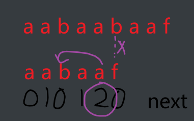

重点是next数组的理解举个例子

第4位：abab

 前缀：a ab aba
        后缀：b ab bab

最长相同：

```
ab
next[4] = 2
```

初始化 前后缀相同的情况和不同的情况，next数组的更新

##### next数组

数组下标从0开始

**for循环实现**

```c
//先明确i是模式串的后缀末尾指针，也就是当前处理字符的下标
//其次j是模式串的前缀末尾指针，也是最长相等前后缀的长度
void getNext(SString T,int next[]){
     //先初始化
     int j=0;next[0]=0;
     for(int i=1;T[i]!='\0';i++){
          //不同的情况
          while(j>0&&T[i]!=T[j]){//j取前一个next值,所以j>0
               j=next[j-1];
          }
          //相同的情况
          if(T[i]==T[j]){
               j++;//最长前后缀长度加一
          }
          //更新next数组
          next[i]=j;
     }
}
```

##### 匹配

i是主串指针，j是模式串指针

```c
int KMP_index(SString T,SString S,int next[]){
     //初始化
     int i=0,j=0;
     while(S[i]!='\0'){//遍历主串
          //不匹配时
          while(j>0&&S[i]!=T[j]){
               j=next[j-1];
          }
          //匹配成功，后移ij
          if(S[i]==T[j]){
               i++;
               j++;
          }else{//j==0也不匹配，只移动主串
               i++;
          }
          if(T[j]=='\0'){//成功后返回第一个匹配的起始下标
               return i-j;
          }
     }return -1;//遍历完主串仍未匹配成功
}
```

##### 主函数

```c
int main(){
    SString S = "ababcabcacbab";  // 主串
    SString T = "abcac";           // 模式串
    int next[100] = {0};   
    getNext(T,next);
     int pos=KMP_index(S,SString T,next);
      if (pos != -1) {
        printf("匹配成功！模式串在主串的起始位置：%d\n", pos);
    } else {
        printf("匹配失败，主串中未找到模式串\n");
    }
    
    return 0;
}
```

nextval的优化

## 第五章

### 5.1树

**树的基本概念**

1. **节点（Node）**：树中的每个元素被称为节点。每个节点可以包含一个数据元素，并与其他节点通过边（Edge）相连接。

2. **根节点（Root Node）**：树的最上层节点称为根节点。根节点没有父节点，是树的起点。

3. **父节点（Parent Node）和子节点（Child Node）**：

   - 每个节点都有一个父节点，除了根节点。
   - 一个节点可以有多个子节点，形成树的分支结构。

4. **叶子节点（Leaf Node）**：没有子节点的节点被称为叶子节点。叶子节点是树的“末端”，通常位于树的最底层。

5. **深度（Depth）**：**从上往下数**从根节点到某个节点的路径长度。深度表示节点距离根节点的**层数**。

6. **高度（Height）**：**从下往上数**树的高度指的是从根节点到最深的叶子节点的最长路径。树的高度越大，意味着树的结构越“深”。

7. **子树（Subtree）**：每个节点及其所有子节点组成的部分树叫做子树。任何节点的子树都是一颗完整的树。

8. **路径（Path）**：从一个结点到另一个结点的唯一一条路线。

9. **结点的度**：有几个分支

10. **树的度**：各节点度的最大值

11. **有序树和无序树**：从左到右子树有次序是有序树，反之是无序树

12. **森林**：m棵**互不相交**的树的集合

    ****

    **树的重要性质**

    结点数=总度数+1

    m叉树或者度为m的树 第i层至多有m^i-1^个结点

    高度为h的m叉树至多有m^h^-1/(m-1)个结点，至少h个

    具有 n 个结点的 m 叉树的最小高度为 ⌈logₘ(n (m - 1) + 1)⌉

    ****

### 5.2二叉树

**概念**：每个结点**最多有两个子结点**，子树有左右之分不能随便颠倒，可以是空树，是**有序树**

**五种状态**：

空二叉树  只有根结点  根 + 左子树  根 + 右子树  根 + 左 + 右子树

#### 特殊二叉树

##### 满二叉树

- 每一层结点数都达到**最大值**
- 所有叶子都在**最底层**
- 高度 h，结点总数：2h−1
- 按层序从 1 开始编号，结点 i 的左孩子为 2i，右孩子为 2i+1；结点 i 的父节点为 [i/2]（如果有的话）

#####  完全二叉树

除了最后一层，其他层都满，最后一层结点**靠左连续排列**

**特点**：只有**最后两层**可能有叶子结点，最多只有一个度为 1 的结点，i<=n/2为分支结点，i>n/2 为叶子结点

**性质**：

- 对于具有 n 个结点（n>0）的完全二叉树，其高度 h 有两种等价的计算方式：

**h=⌈log~2~(n+1)⌉或h=⌊log~2~n⌋+1**

- 完全二叉树最多只有 **1 个** 度为 1 的结点，即 **n1=0 或 1**,通用二叉树性质：**n0=n2+1**,那么n0+n2=(n2+1)+n2=2n2+1，一定是**奇数**
- n=2k（偶数个结点）因为 n0+n2 是奇数，所以 **n1 必须为 1** 才能使总数 为偶数。
- n=2k−1（奇数个结点）因为 n0+n2 是奇数，所以 **n1 必须为 0** 才能使总数  为奇数。

##### 二叉排序树BST

左子树上**所有结点的值 < 根结点的值**

右子树上**所有结点的值 > 根结点的值**

左右子树**本身也是二叉排序树**

**左小、右大**

##### 平衡二叉树

左右子树的高度差的绝对值 ≤ 1并且**左右子树也都是平衡二叉树**。

#### 性质

- 叶子结点比二分支结点多一个，n0=n2+1[^footnote]

- 二叉树第 i 层（i≥1）至多有 2^i−1^ 个结点,m 叉树第 i 层（i≥1）至多有 m^i−1^ 个结点

- 高度为 h 的二叉树，至多有 2^h^−1 个结点,也就是满二叉树

- 高度为 h 的 m 叉树，至多有 m^h^−1/m−1 个结点(等比数列求和m^0^+m^1^+……)

  [^footnote]: n0 = 叶子结点数,n2 = 度为 2 的结点数


#### 二叉树的存储结构

##### 顺序存储

适用**完全二叉树 / 满二叉树**

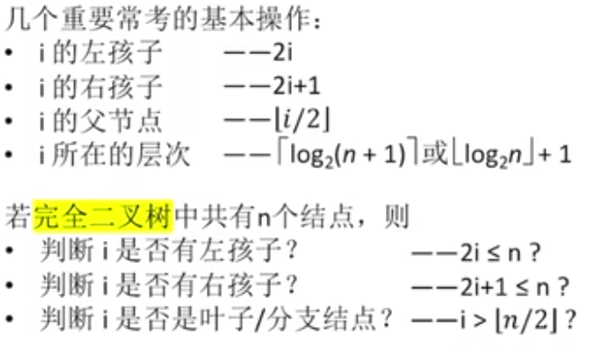

对于非完全二叉树来讲，对应起来之后基本操作可以执行，但是是否右左右孩子只能通过2i的结构体中isEmpty的真假了

##### 链式存储

每个结点包含三部分：

- 数据域

- 左孩子指针（没有就是NULL

- 右孩子指针

  

  ```c
  typedef struct BiTNode{
       int data;
       struct BiTNode*lchild,*rchild;
  }BiTNode,*BiTree;
  ```

  `BiTree` 是 `BiTNode*` 的别名，指向二叉树结点的指针类型


### 5.3遍历

**先中后序遍历**

先序遍历根 → 左 → 右    前缀表达式

中序遍历左 → 根 → 右     中缀表达式（加界限符

后序遍历左 → 右 → 根     后缀表达式


#### **先序遍历**

```c
void PreOrder(BiTree T){
     if(T!=NULL){
          visit(T);//访问根
          PreOrder(T->lchild);//遍历左子树
          PreOrder(T->rchild);//遍历右子树
     }
}
```

#### **中序遍历**

```c
void InOrder(BiTree T) {
    if (T != NULL) {
        InOrder(T->lchild);     // 遍历左子树
        printf("%d ", T->data); // 访问根
        InOrder(T->rchild);     // 遍历右子树
    }
}
```

#### **后序遍历**

```c
void PostOrder(BiTree T) {
    if (T != NULL) {
        PostOrder(T->lchild);   // 遍历左子树
        PostOrder(T->rchild);   // 遍历右子树
        printf("%d ", T->data); // 访问根
    }
}
```

##### **求树的深度**

```c
int treeDepth(BiTree T){
     if(T==NULL){
          return 0;
     }else{
          int l=treeDepth(T->lchild);
          int r=treeDepth(T->rchild);
          return l>r?l+1:r+1;//加上根节点
     }
}
```

#### 层次遍历

（Level Order Traversal）BFS

**思想**-----先进先出FIFO

1. 根节点入队
2. 只要队列不为空：
   - 出队一个节点
   - 访问该节点
   - 如果有左子节点 → 入队
   - 如果有右子节点 → 入队

- 定义二叉树结点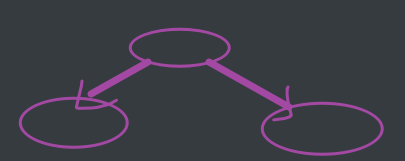

```c
typedef struct TreeNode{
     int data;
     struct TreeNode*lchild;
     struct TreeNode*rchild;
}TreeNode;
```

- 定义队列节点（存储二叉树结点指针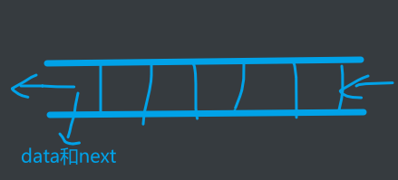

```c
typedef struct QueueNode{
     TreeNode*data;// 队列元素是二叉树结点指针
     struct QueueNode*next;
}QueueNode;
```

- 定义队列

```c
typedef struct{
     QueueNOde*front;//队头
     QueueNode*rear;//队尾
}LinkQueue;
```

- 初始化队列

```c
void InitQueue(LinkQueue *q) {
    q->front = q->rear = (QueueNode *)malloc(sizeof(QueueNode));
    q->front->next = NULL;  // 空队列，队头后继为NULL
}
```

- 创建二叉树结点（辅助函数）

```c
TreeNode *CreateTreeNode(int data) {
    TreeNode *node = (TreeNode *)malloc(sizeof(TreeNode));
    node->data = data;
    node->lchild = NULL;
    node->rchild = NULL;
    return node;
}
```

- 二叉树层序遍历

```c
void LevelOrder(TreeNode *root) {
    if (root == NULL) {
        printf("二叉树为空！\n");
        return;
    }
    
    LinkQueue q;
    InitQueue(&q);          // 初始化队列
    EnQueue(&q, root);      // 根结点入队
    
    TreeNode *curNode;
    while (!IsEmpty(&q)) {  // 队列不为空则循环
        DeQueue(&q, &curNode); // 出队一个结点
        printf("%d ", curNode->data); // 访问该结点
        
        // 左孩子存在则入队
        if (curNode->lchild != NULL) {
            EnQueue(&q, curNode->lchild);
        }
        // 右孩子存在则入队
        if (curNode->rchild != NULL) {
            EnQueue(&q, curNode->rchild);
        }
    }
}
```

##### 遍历序列构造二叉树

**仅根据前序、中序、后序或层序遍历序列中的一种，无法唯一确定一棵二叉树**。

前，后，层序+**中序**遍历序列就可以确定了

#### 线索二叉树

线索二叉树适用于：

- 读多写少的树结构

- 需要频繁遍历

- 需要**快速找前驱/后继**

  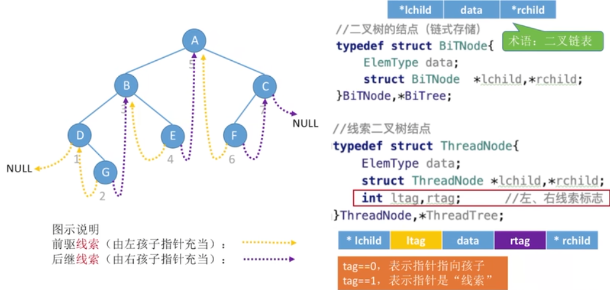

##### 线索化

**中序线索化**(递归实现)

```c
Node*pre=NULL;
void InThread(Node*p){
     if(p!=NULL){
          InTread(p->left);
          if(p->left==NULL){
               p->left=pre;
               p->LTag=1;//1代表是线索，而不是左子树
           }
          if(pre!=NULL&&pre->right==NULL){
               pre->right=p;
               pre->RTag=1;
           }
          pre=p;
          InTread(p->right);
     }
}
```

前序线索化

**⚠️ 如果当前节点左指针被改为线索， 就不能再递归左子树**

后序线索化遍历非常复杂

##### 寻找中序后继

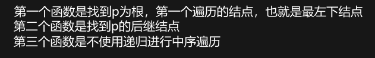

```c
Node*FirstNode(Node*p){
     while(p->LTag==0){//有左孩子
          p=p->left;
     }
     return p;
}

Node*NextNode(Node*p){
     if(p->RTag==1){//有线索
          return p->right;
     }else{
          p=p->right;
          while(p->LTag==0){//有左孩子，因为是中序所以是按照左根右的，后继是左下角的结点
               p=p->left;
          }
          return p;
     }
}

void Inorder(ThreadNode*T){
     for(ThreadNOde*p=Firstnode(T);p!=NULL;p=Nextnode(p))
          visit(p);//令p是根节点
}
```

**中序求前驱**

和后继类似，先判断LTag是0还是1，0的话就是前驱，1的话一直求右孩子

**先序求后继**

根左右，求p的后继，先看有没有左孩子

有左孩子且是叶子结点，那么这个结点就是后继结点

有左孩子不是叶子节点，无所谓，还是它

没有左孩子，那么就是右孩子第一个，无论是不是叶子结点

**先序求前驱**

只能从头遍历，因为后面的都是后继结点

除非是用三叉链表可以找到父节点

①p 是父节点的**左孩子**---p 的**父节点**

②p 是父节点的**右孩子**，且**左兄弟为空**---p 的**父节点**

③p 是父节点的**右孩子**，且**左兄弟非空**---p 的**左兄弟子树中，先序遍历最后一个被访问的节点**

④p 是**根节点**  **无**先序前驱

**后序求前驱**

若p有右孩子，前驱就是右孩子

若p没有右孩子，前驱就是左孩子

三叉树自己退后驱·

### 5.4.1树的存储结构

#### 双亲表示法

用数组存所有结点，每个结点只记录：自己的双亲下标

```c
typedef struct{
    ElemType data;
    int parent;   // 双亲在数组中的下标
}PTNode;

PTNode tree[MAXSIZE];
```

✅ 找双亲非常方便❌ 找孩子非常麻烦

双亲表示法适合找父亲，不适合找孩子。

#### 孩子表示法

对每一个结点：👉 单独维护一个“孩子链表”。

结点分两层结构：

**表头数组**

```c
typedef struct{
    ElemType data;
    struct ChildNode *firstChild;
}CTBox;
```

**孩子链表结点**

```c
typedef struct ChildNode{
    int child;   // 孩子在表中的下标
    struct ChildNode *next;
}ChildNode;
```

✅ 找某结点的所有孩子非常方便❌ 找双亲不方便 

#### 孩子兄弟表示法

规则：

- left 指向第一个孩子
- right 指向下一个兄弟

```c
typedef struct CSNode{
    ElemType data;
    struct CSNode *firstChild;
    struct CSNode *nextSibling;
}CSNode;
```

✅ 结构简单
       ✅ 存储统一
       ✅ 可以直接复用二叉树的很多算法思想

❌ 找某个结点的父亲不方便

### 5.4.2树 森林 二叉树

#### **树 → 二叉树**

👉 **“左孩子，右兄弟”**

每个结点：

- **左指针** → 指向它的第一个孩子
- **右指针** → 指向它的下一个兄弟

只保留这两种关系

断开原来“父 → 所有孩子”的直接关系

**任意一棵树，都可以通过孩子兄弟表示法，唯一地转换成一棵二叉树。**

#### 森林 → 二叉树

👉 **先把每一棵树，分别转换成二叉树**（用的还是“左孩子右兄弟”）

👉 把 **各棵树的根** 看成兄弟关系

👉 用**右指针**把这些根连起来

**各树先转二叉，再把根当兄弟用右指针连接**

#### 二叉树 → 树

找根

根的左子树：

- 是它的所有孩子链

沿着右指针：

- 依次还原兄弟关系

#### 树 ↔ 森林 

### 5.4.3树和森林的遍历

#### 树的先根遍历（Preorder of Tree）

先访问根结点，再依次遍历各棵子树（从左到右）

#### 树的后根遍历（Postorder of Tree）

先依次遍历各棵子树，再访问根结点

#### 树的层次遍历

#### 森林的先序遍历

依次对森林中的每一棵树进行先根遍历

森林的先序遍历
 = 转换成二叉树后的前序遍历

#### 森林的中序遍历

1. 对森林中的**第一棵树的根结点的子树森林**进行中序遍历
2. 访问第一棵树的根
3. 对森林中**剩余的树**进行中序遍历

### 5.5.1哈夫曼树（Huffman Tree）

👉 **最省带权路径长度的二叉树**

带权路径长度（WPL）

WPL=所有叶子结点的权值 × 从根到该叶子的路径长度 之和

**构造思想（一句话）**

> **每次选权值最小的两个结点合并**


**哈夫曼编码（Huffman Coding）**在哈夫曼树基础上产生的 **最优前缀编码**

**编码规则:**

- 左分支：0
- 右分支：1
   （反过来也行，只要统一）

**性质**

1. 哈夫曼树的 WPL 最小
2. 不存在只有一个孩子的结点，结点的度只能是 **0 或 2**
3. 哈夫曼树 **不一定唯一** 但 **WPL 一定唯一**
4. 若有 n 个叶子结点：
   - 总结点数 = **2n − 1**
   - 内部结点数 = **n − 1**

### 5.5.2并查集

这条边的两个点，如果本来就连通 → 这条边就是多余的。

并查集（Union-Find / Disjoint Set Union, DSU）

**合并（Union）**：把两个元素所在的集合合并

**查询（Find）**：判断两个元素是否在同一个集合中

**使用双亲表示法，有一个S数组专门记录父节点的下标**

#### 解决的问题

判断两个点是否连通

统计连通块数量

构建最小生成树

判断图中是否有环

#### 基础版本

数组里面根节点的S数组是负数，当遍历到负数的时候，停止

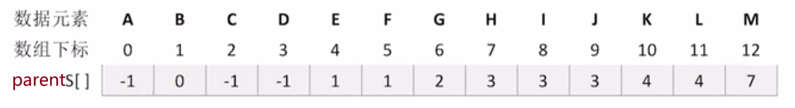

```c
int parent[N];
int find (int parent[],int x){//查找根节点
     while(parent[x]>=0)x=parent[x];
     return x;//小于0是根节点
}
void Union(int parent[],int Root1,int Root2){
     if(Root1==Root2)return;
     parent[Root2]=Root1;//将2的根连在1的下面
}
```

#### 按秩合并（Union by Rank）

小树挂到大树下面，怎么做到呢？

比较两棵树的结点数，此时S数组中，根节点的值是节点数的负数，我们比较大小就可以判断了


```c
void Union(int parent[],int Root1,int Root2){
     if(Root1==Root2)return;
     if(parent[Root2]>parent[Root1]){//根结点存放总结点树且是负的，2的数量更少的话
          parent[Root1]+=parent[Root2];
          parent[Root2]=Root1;
     }else{
          parent[Root2]+=parent[Root1];
          parent[Root1]=Root2;
     }
}
```

#### 路径压缩（Path Compression）

在查找根节点的同时，把沿途所有节点直接挂到根上

其实就是S数组里，直接把节点值为根节点下标就好了

```c
int Find(int parent[],int x){//查找x的根节点
     int root=x;
     while(parent[root]>=0)root=parent[root];
     while(x!=root){
          int t=parent[x];//对于每隔路过的结点都改变
          parent[x]=root;
          x=t;
     }
     return root;
}
```

## 第六章

### 6.1图

#### 图（Graph）

在 **Graph Theory** 中，图由两部分组成：

- **顶点（Vertex / Node）**
- **边（Edge）**

**分类**：

1. 1️⃣ 无向图（Undirected Graph）：边没有方向。
2. 2️⃣ 有向图（Directed Graph）：边有方向。
3. 3️⃣ 带权图（Weighted Graph）：每条边有权值。

##### 基本概念

1️⃣ 度（Degree）：顶点连接的边数量

2️⃣ 入度和出度（有向图）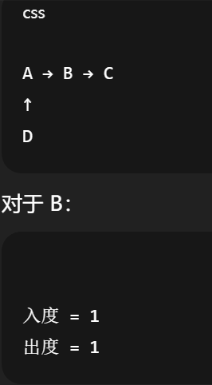

3️⃣ 路径（Path）：长度 = 边数

4️⃣ 环（Cycle）：起点 = 终点

5️⃣ 连通图（Connected Graph）：无向图中：任意两个点都有路径。

6️⃣ 连通分量（Connected Component）：一个图中可能有多个独立部分

### 6.2.1邻接矩阵法（Adjacency Matrix）

**无向图**

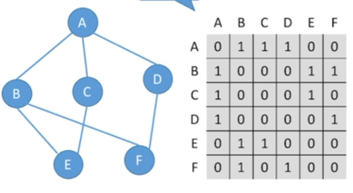

有向图

例如A->B就是第一行第二列

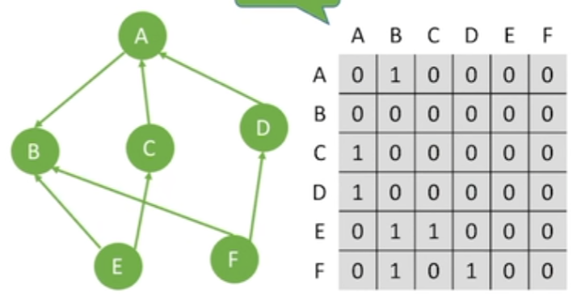

```c
#define N 100

int graph[N][N];
int n;

void addEdge(int u,int v){
    graph[u][v]=1;
    graph[v][u]=1;
}
```

**稀疏图很浪费空间。**---空间复杂度高

### 6.2.2邻接表（Adjacency List）

用链表或数组存储。

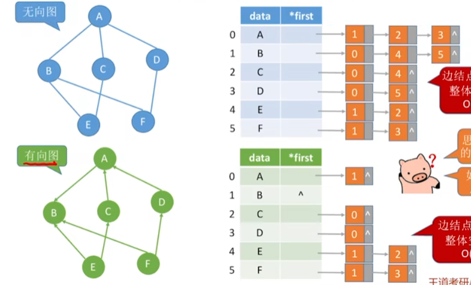

```c
#include <stdio.h>
#include <stdlib.h>

typedef struct Node{
    int v;
    struct Node* next;
}Node;

Node* graph[100];

void addEdge(int u,int v){
    Node* node=(Node*)malloc(sizeof(Node));
    node->v=v;
    node->next=graph[u];
    graph[u]=node;
}
```

### 6.2.3-4

**十字链表（Orthogonal List）**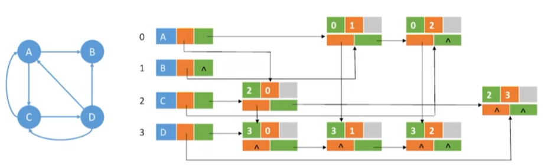

十字链表是 **有向图的链式存储结构**。

**邻接多重表（Adjacency Multilist）**

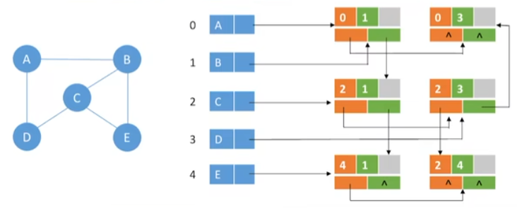

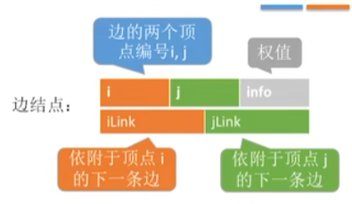

### 6.2.5图的基本操作

<弧>  （边）

#### 判断是否存在边

1️⃣ 邻接矩阵

```c
int hasEdge(int u,int v){
    return graph[u][v];
}
```

2️⃣ 邻接表

```c
int hasEdge(int u,int v){

    Node* cur = adjList[u];

    while(cur){
        if(cur->vertex == v)
            return 1;
        cur = cur->next;
    }

    return 0;
}
```

#### 图 G 中插入顶点 x

邻接矩阵

```c
#define MAX 100

int graph[MAX][MAX];
int n;   // 当前顶点数

void insertVertex(){

    if(n >= MAX){
        printf("图已满\n");
        return;
    }

    for(int i = 0; i <= n; i++){
        graph[n][i] = 0;
        graph[i][n] = 0;
    }

    n++;
}
```

邻接表

```c
#include <stdlib.h>

#define MAX 100

typedef struct Node{
    int vertex;
    struct Node* next;
}Node;

Node* adjList[MAX];
int n;
```

#### 图 G 中删除顶点 x

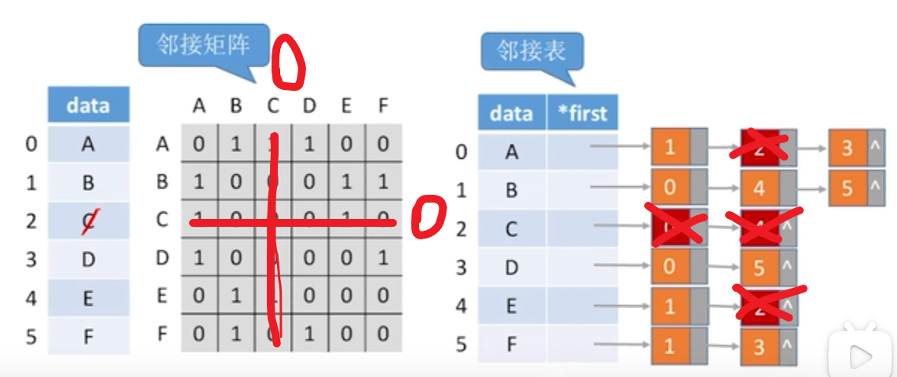

#### 添加边

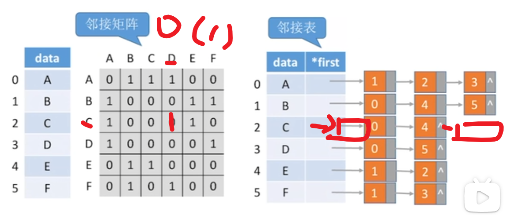

### 6.3.1图的广度优先遍历

**无向图**


```c
int visit[MAX];
void BFST(Graph G){
     for(i=0;i<G.vexnum;++i){
          visit[i]=0;//初始化
     }
     InitQueue(Q);
     for(i=0;i<G.vexnum;++i){
          if(!visited[i])
               BFS(G,i);//访问
     }
}
void BFS(Graph G,int v){//顶点v
     visit(v);
     visit[v]=1;//标记
     enqueue(Q,v);
     while(!isEmpty(Q)){
          dequeue(Q,v);//出队
          for(w=FirstNeighbor(G,v);w>=0;w=NextNeighbor(G,v,w)){
               if(!visit[w]){//w是没有访问的邻接顶点
                    visit(w);
                    visit[w]=1;
                    enqueue(Q,w);
               }
          }
     }
}
```

**有向图**

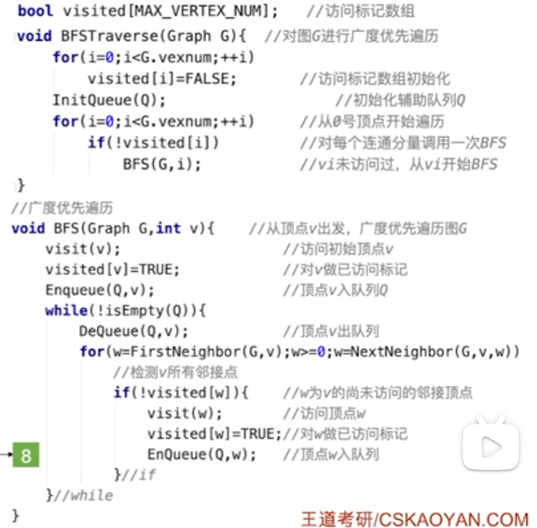

### 图的深度优先遍历

广度优先遍历到一个节点时会把邻接结点依次就访问了，深度一次只会访问一个邻接结点，递归调用

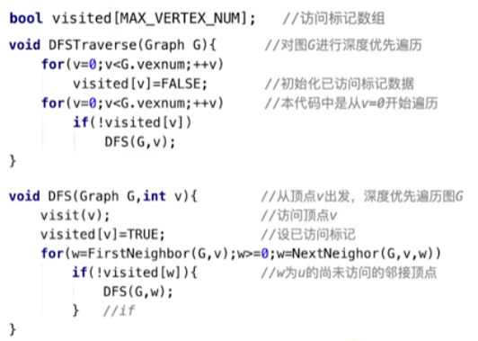

### 6.4.1最小生成树

前提： 图必须是 **连通无向图**，并且 **边带权值**。

**生成树（Spanning Tree）**：包含 **所有顶点**，**没有环**但连通，**边数**为 **n − 1**

若👉 **边的权值总和最小**，这棵树就叫 **最小生成树**。

#### Prim算法

从一个顶点开始，每次选一个最小权值边，连接一个新的顶点

适合**稠密图**

#### Kruskal算法

每次选最小权值的边，但不能形成环，**先连边**

适合**稀疏图**

### 6.4.2最短路径问题

#### BFS算法（无权图

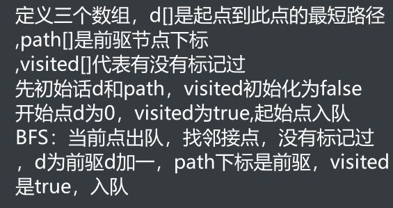

```c
void BFS_min_distance(Graph G,int u){//u到其他顶点的最短路径
     for(i=0;i<G.vexnum;++i){
          d[i]=∞;
          path[i]=-1;
     }
     d[u]=0;
     visited[u]=TRUE;
     enqueue(Q,u);
     while(!isEmpty(Q)){
          dequeue(Q,u);
          for(w=FirstNEighbor(G,u);w>=0;w=NextNeighbor(G,u,w))
               if(!visited[w]){
                    d[w]=d[u]+1;
                    path[w]=u;
                    visited[w]=TRUE;
                    enqueue(Q,w);
               }
     }
}
```

#### Dijkstra算法（带权图，无权图

不使用有负值的权图

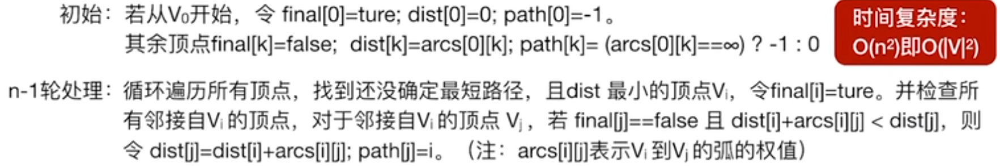

#### Floyd算法（带权图，无权图

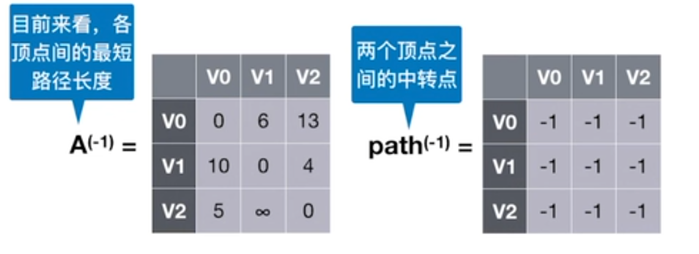

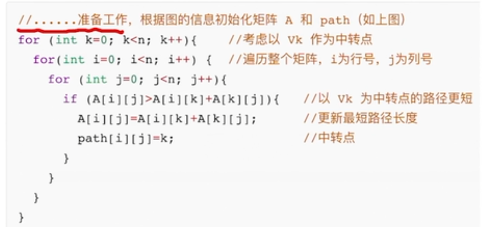

可以用于赋值权图，但是处理不了有负权值边组成回路的图

### 6.4.3有向无环图描述表达式

一个 **有向图** 中 **不存在任何有向环**，这样的图叫 **有向无环图**（DAG）。

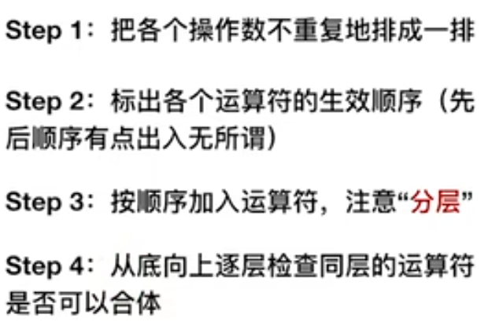

### 6.4.4拓扑排序（没懂

**AOV网（Activity On Vertex）** 是一种用 **有向无环图（DAG）** 表示任务关系的模型。

**拓扑排序（Topological Sort）** 是对 **AOV 网中的顶点进行线性排序**

- **只有 DAG 才能进行拓扑排序**
- 结果 **可能不唯一**

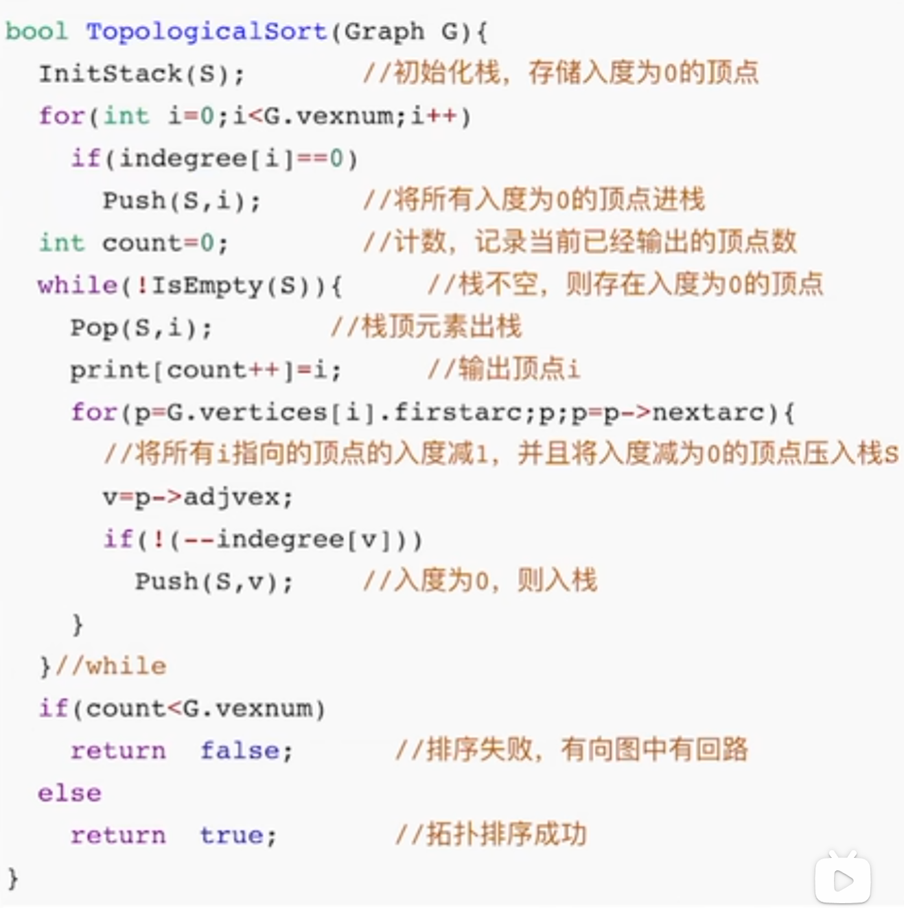

### 6.4.5关键路径

在 **AOE网（Activity On Edge）** 中：

- **顶点（Vertex）**：表示事件（Event）
- **边（Edge）**：表示活动（Activity）
- **边的权值**：表示活动持续时间

### 7.1查找

在一组数据中，**按关键字找到对应记录**的过程。

**两大类查找**：. **静态查找**（只查不改），**动态查找**（可插入、删除、查找）

**平均查找长度**：

**ASL** = **Average Search Length**---查找时，需要**比较关键字的平均次数**。

**关键字（Key）**：用来**唯一标识 / 比较**一个数据元素的那个值。

### 7.2.1顺序查找（Sequential Search）

**顺序查找**就是从表的 **第一个元素开始，一个一个往后比较**，直到找到目标元素或者查找完整个表。

无哨兵节点

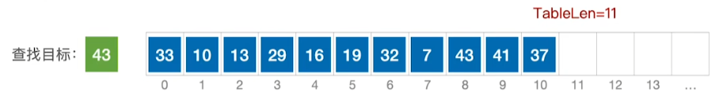

有哨兵节点

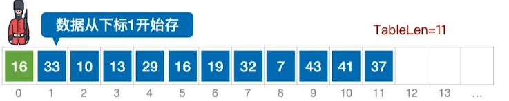

```c
typedef struct{
     int*elem;//动态数组的地址
     int TableLen;//表长
}SSTable;
//无哨兵节点
int Search_Seq(SSTable ST,int key){
     int i;
     for(i=0;i<ST.TableLen&&ST.elem[i]!+key;++i)
          return i==ST.TableLEn?-1:i;
}
//有哨兵节点
int Search_Seq(SSTable ST,int key){
     ST.elem[0]=key;
     int i;
     for(i=ST.TableLen;ST.elem[i]!=key;--i)
          return i;//失败返回0
}
```

ASL=查找长度*相同的概率

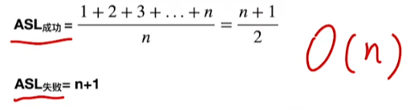

若查找表顺序存放

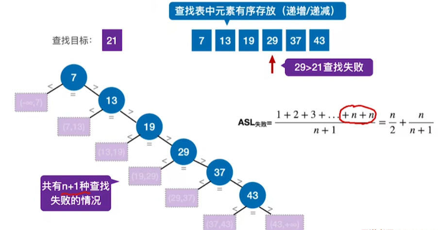

### 7.2.2折半查找（二分查找）

**折半查找**每次把查找范围 **缩小一半**。

**⚠️ 前提条件：**  **数据必须有序（升序或降序）**

只适用于有序的顺序表

```c
low = 0;
high = TableLEn-1;
int Binary_Search(SSTable L,int key){
   while (low <= high){
    mid = (low + high) / 2

    if (L.[mid] == key)
        return mid;
    else if (key < L.[mid])
        high = mid - 1;
    else
        low = mid + 1
   }return -1;//查找失败返回
}
```

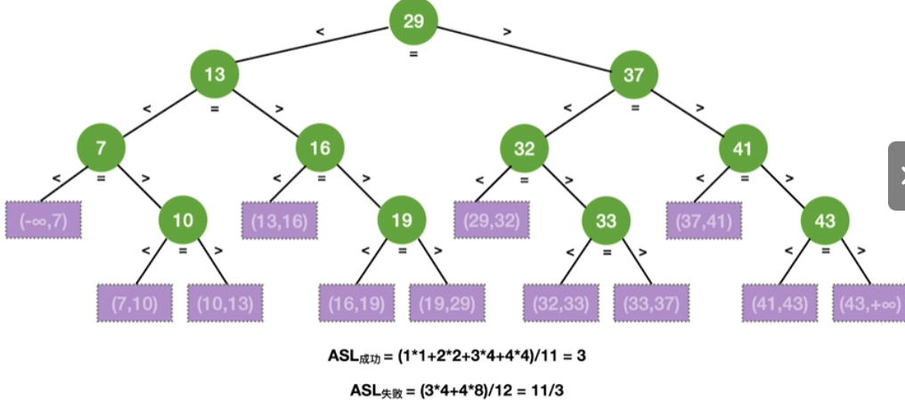

3*4代表有四个元素需要进行3次关键字对比

并且**右子树结点数-左子树结点数=0或1**（总数偶数个为0，奇数个为1

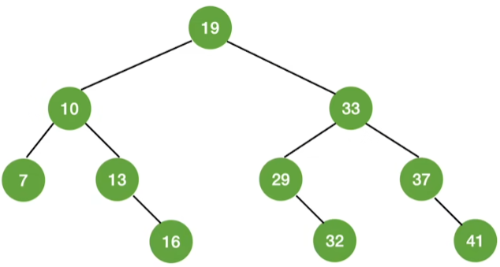

### 7.2.3分块查找

**块间有序，块内无序。**

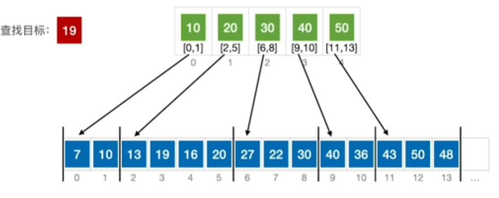

1️⃣ 先在 **索引表中确定目标在哪一块**
       2️⃣ 再在 **该块内部顺序查找**

若使用折半查找索引表，最后得到low>hign,那么要在**low分块**中查找元素

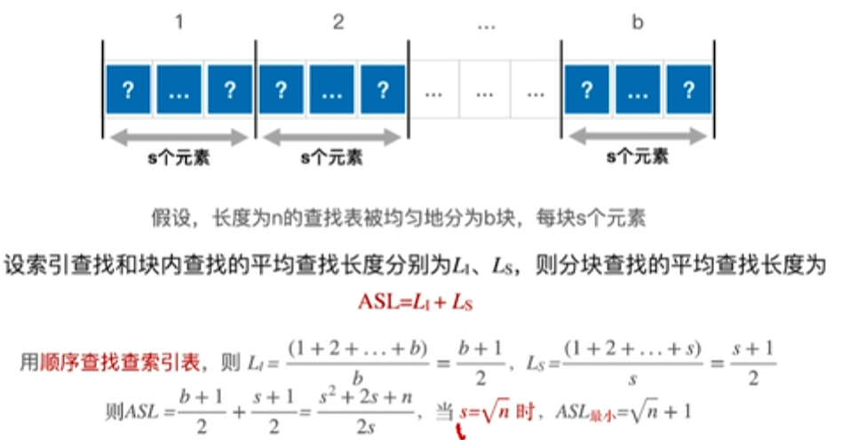

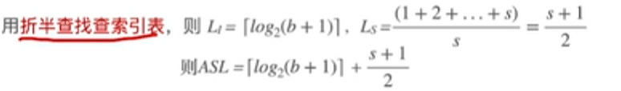

### 7.3.1二叉排序树

二叉排序树 **（Binary Search Tree，BST）**属于 **二叉树的一种特殊形式**

对于任意一个结点 `x`：

**左子树**所有结点的关键字 <`x` 的关键字 < **右子树**所有结点的关键字

左右子树 **也分别是二叉排序树**

> **左小右大**

**查找**

在二叉排序树中查找值为key的结点

```c
BSTNode*BST_Search(BSTree T,int key){
     while(T!=NULL&&key!=T->key){//循环！实现
          if(key<T->key)T=T->lchild;
          else T=T->rchild;
     }
     return T;
}
BSTNode*BST_Search(BSTree T,int key){//递归实现
     if(T==NULL)return NULL;
     if(key==T->key)return T;
     else if(key<T->key)
          return BSTSearch(T->lchild,key);
     else
          return BSTSearch(T->rchild,key);
}
```

**插入**

```c
int BST_Insert(BSTree *T,int k){//递归
     if(T==NULL){//新插入结点的处理
          T=(BSTree)malloc(sizeof(BSTNode));
          T->key=k;
          T->lchild=T->rchild=NULL;
          return 1;
     }
     else if(k==T->key)return 0;//已经存在相同的结点所以失败
     else if(k<T->key)return BST_Insert(T->lchild,k);
     else return BST_Insert(T->rchild,k);
}
```

**二叉排序树的构造**

```c
void Create_BST(BSTree *T,int str[],int n){
     T=NULL;
     int i=0;
     while(i<n){
          BST_Insert(T,str[i]);
          i++;
     }
}
```

### 7.3.2平衡二叉树

（Balanced Binary Tree / **AVL**树）

**定义：**

> **对于树中任意一个结点，其左右子树的高度差的绝对值不超过1**

**平衡因子（Balance Factor）**：BF = 左子树高度 - 右子树高度

**最小不平衡子树**：在插入或删除结点后，从该结点向上查找，**第一个平衡因子绝对值大于1的结点所形成的子树**，称为 **最小不平衡子树**。

**空树的高度为 -1**，**叶子节点（无子女）的高度为 0**。

**空树**指的是 “不存在的子树”，也就是一个节点没有左孩子或没有右孩子的情况。

#### 平衡二叉树的调整（旋转）

#####  LL型（右旋）

插入在左孩子的左子树

##### RR型（左旋）

插入在右孩子的右子树

##### LR型（先左旋再右旋）

插入在左孩子的右子树

##### RL型（先右旋再左旋）

插入在右孩子的左子树


##### 分析

n0=0（空树）

n1=1（只有根结点）

n2=2（根结点 + 一个子结点）

n~h~=n~h−1~+n~h−2~+1：要构造一棵深度为 h 的结点数最少的平衡树，其根结点的左右子树必须也是结点数最少的平衡树，且深度分别为 h−1 和 h−2，再加上根结点本身，因此总结点数为 nh−1+nh−2+1。

#### 删除

① 按二叉排序树方法删除节点
       ② 检查是否失衡并进行旋转调整

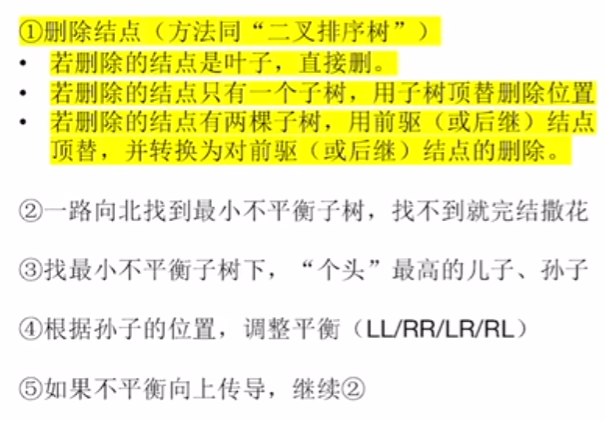

### 7.3.3红黑树

#### 定义

（Red-Black Tree）**红黑树**是一种非常重要的 **自平衡二叉搜索树**

每个节点有两种颜色：红色（Red） 黑色（Black）

**红黑树必须满足5个性质**：

***左根右 根叶黑 不红红 黑路同***

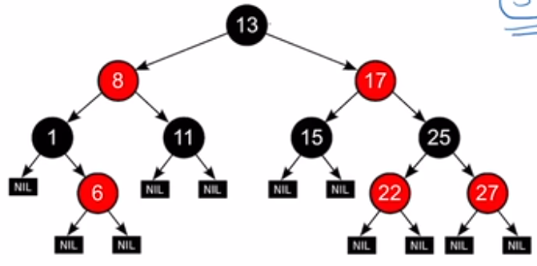

1. 根节点是黑色

2. 每个节点要么红要么黑

3. 所有叶子节点都是黑色

4.  红节点不能连续

5. 任意节点到叶子路径 黑节点数相同

   比如说到1的左孩子，那么要经过1和null两个黑色节点

**AVL：查找更快**
     **红黑树：更新更快** 

黑高bh：从某节点开始到任意空叶节点的路径上黑节点总数

#### **基本结构**

```c
struct Node{
     int key;
     Node*left;
     Node*right;
     Node*parent;
     int color;
};
```

**性质 1**：从根节点到叶结点的最长路径不大于最短路径的 2 倍。

**性质 2**：有 n 个内部节点的红黑树高度 h≤2log~2~(n+1)。

#### 插入

> **1 插入节点（BST方式）**
>
> **2 调整颜色 + 旋转**

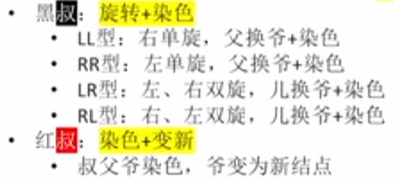


#### 删除

太难不想学


### 7.4.1B树：多路平衡查找树

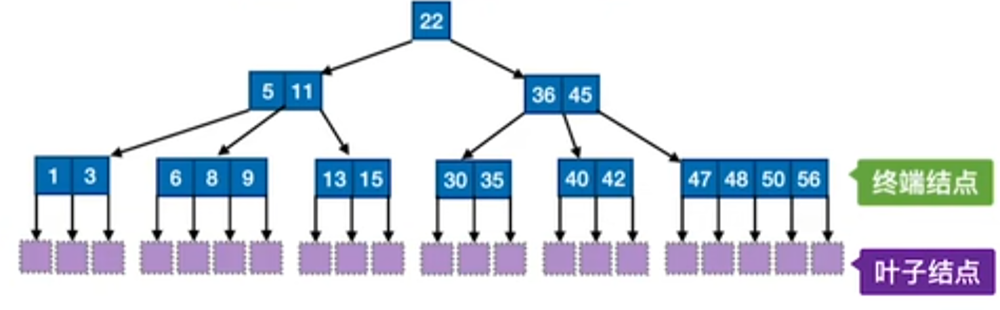

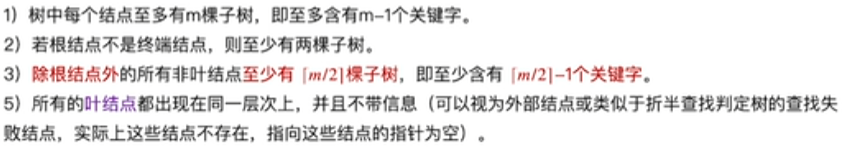

B树中所有结点的孩子个数的最大值是B树的阶，用m表示，例如上图是5阶b树

**B树的高度**

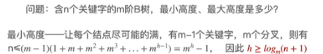

m-1是一个m阶b树一个节点最多的关键字，然后乘上分叉数量

根最多有m分叉，第二层就是m^2^个······

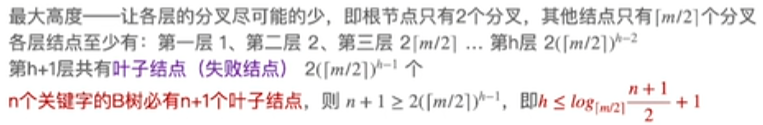

**插入与删除**

看视频吧

### 7.4.2B+树

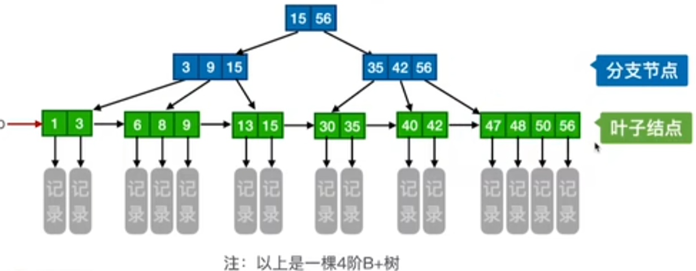

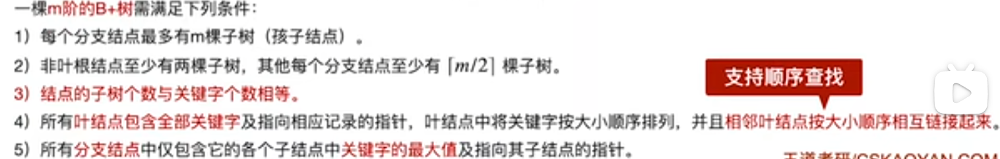

B+树与B树的对比

1. n 个关键字对应**n 棵子树**
2. 根节点关键字数 n∈[1,m]，其他结点（非根、非叶子）关键字数 n∈[⌈m/2⌉, m]
3. 在B+树中，叶结点包含全部关键字，非叶结点中出现过的关键字也会出现在叶结点中
4. 在B+树中，叶结点包含信息，所有非叶结点仅起索引作用，非叶结点中的每个索引项只含有对应子树的**最大关键字**和**指向该子树的指针**，不含有该关键字对应记录的存储地址

### 7.5.1散列表（Hash Table）

散列表通过一个叫 **哈希函数（Hash Function）** 的方法，把 **键（key）转换成数组下标**，从而快速找到数据的位置。

#### 哈希冲突（Collision）

不同的 key 可能得到 **同一个下标**，这叫 **哈希冲突**。

解决方法有两种常见方式：

##### 1️⃣ 链地址法（Chaining）

##### 2️⃣ 开放地址法（Open Addressing）

### 7.5.2哈希函数（散列函数

哈希函数中除以的那个数就是桶数量，数组总大小

```c
#define MAX(a,b) ((a)>(b)?(a):(b))
#define HASH_SIZE 200003

typedef struct Node{
    int key;
    int val;
    struct Node*next;
}Node;

Node*hash[HASH_SIZE];


int hashfunc(int key){
    if(key<0)key=-key;
    return key%HASH_SIZE;
}

Node*find(int key){//找到桶下面的key值代表的链表
    int h=hashfunc(key);
    Node*cur=hash[h];
    while(cur){
        if(cur->key==key)return cur;
        else{
            cur=cur->next;
        }
    }return NULL;
}
void insert(int key){//哈希表插入，这里是记录数字出现次数
    int h=hashfunc(key);//获取桶索引
    Node*node=find(key);//获取到具体的链表
    if(node)node->val++;
    else{
        node=(Node*)malloc(sizeof(Node));
        node->key=key;
        node->val=1;
        node->next=hash[h];//指向头结点，头插法
        hash[h]=node;//更新头结点     
    }
}
int distinctcount(){//统计每个桶下面不同的数字数
    int count=0;
    for(int i=0;i<HASH_SIZE;i++){
        Node*cur=hash[i];//找到每个桶头结点
        while(cur){
            count++;
            cur=cur->next;
        }
    }
    return count;
}
void removekey(int key){
    int h=hashfunc(key);
    Node*cur=hash[h];
    Node*prev=NULL;
    while(cur){
        if(cur->key==key){
            cur->val--;
            if(cur->val==0){
                if(prev){
                    prev->next=cur->next;
                }else{
                    hash[h]=cur->next;
                }
                free(cur);//删除结点
            }return;
        }
        prev=cur;
        cur=cur->next;
    }
}
long long maxSum(int* nums, int numsSize, int m, int k) {
    for(int i=0;i<HASH_SIZE;i++) hash[i] = NULL;
    long long sum=0,tmp=0;
    for(int i=0;i<numsSize;i++){//入
        tmp+=nums[i];
        insert(nums[i]);
//判定
        int left=i-k+1;
        if(left<0)continue;
//更新
        if(distinctcount()>=m)sum=MAX(tmp,sum);
//出
        int out=nums[left];
        tmp-=out;
        //移除
        removekey(out);
    }
    return sum;
}
```


#### 除留余数法

h(key)=key % p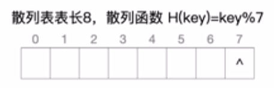

p 一般取**不大于哈希表长度的最大质数**


####  直接定址法

h(key)=a×key+b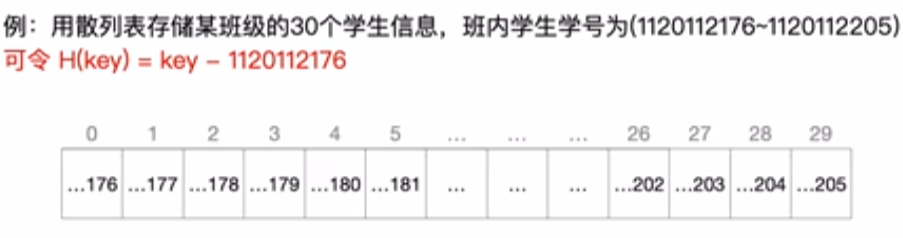

无冲突    但只适合 **key 连续、范围小** 的情况

#### 数字分析法

看 key 哪些位分布均匀，就取哪些位

适合 key 已知、数量固定的场景

#### 平方取中法

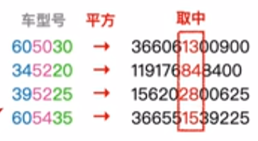

### 7.5.3处理冲突的方法

**插入**

#### 链地址法（开散列 / 拉链法）

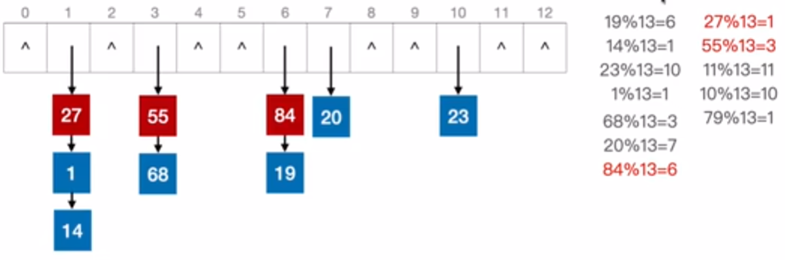

**每一个下标代表一个桶，查找数据时通过索引先定位桶的位置然后再遍历桶下面的链表结构**

####  开放定址法（闭散列）

发生冲突后，需要找到另一个空闲的位置

有四种常用方法构造探测序列

假设散列函数H(key)=key%13

**线性探测法**

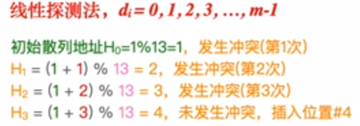

**平方探测法**

至少可以探测到一半的位置，所以说，即使有空闲的位置也未必可以插入成功

但是

若散列表长度m可以表示成4j+3的素数，例如7，11等，就可以探测到所有位置

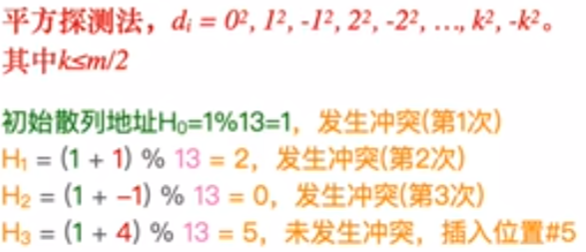

**双散列法**

未必可以探测到所有位置，若第二个散列函数计算得到的值与散列表表长m互质，才能保证探测到所有单元

假设散列函数hash~2~(key)=13-(key%13)

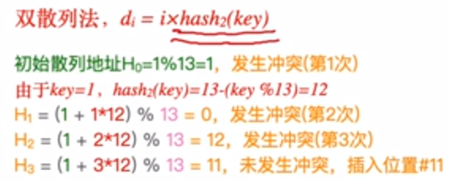

 **伪随机序列法**

取决于序列怎么定义

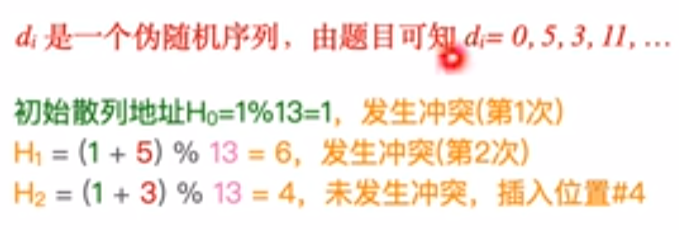

#### 删除

⚠️ **核心要点**：

在采用 “开放定址法” 的哈希表中，不能直接将被删元素的空间置为空。如果这样做，会导致在它之后插入的、因发生冲突而向后探测的元素，在后续查找时被 “截断”，从而无法被找到。

✅ **正确做法**：

对要删除的元素做一个 “已删除” 标记（例如用一个特殊值或状态位表示），进行**逻辑删除**。这样在后续的查找和插入操作中，探测路径依然完整，不会影响其他元素的访问。

### 7.5.4散列查找的性能分析

===以后再说吧

## 第八章

### 8.1排序（Sorting）

> 将一组无序的数据按照某种规则（如从小到大或从大到小）重新排列

分类

- 内部排序：数据都在内存中
- 外部排序：数据太多，无法全部放入内存

### 8.2.1插入排序

**基本思想**

假设左边的元素已经排好序，每次从右边取一个元素，**插入到左边合适的位置**。

**步骤**

1. 从第 **2 个元素**开始
2. 与前面的元素比较
3. 如果前面的元素更大，就向后移动
4. 找到合适位置插入

```c
void insertsort(int arr[],int n){//排序arr，共n个元素
     for(int i=1;i<n;i++){
          int key=arr[i];//当前项
          int j=i-1;//依次比较前面的项
          while(j>=0&&arr[j]>key){//前面的大于当前的
               arr[j+1]=arr[j];
               j--;
          }
          arr[j+1]=key;
     }
}
```

优化---》**折半插入排序**

```c
//先搞low hign mid，再移动，插入
void binaryinsertsort(int arr[],int n){
     int i,j,low,hign,mid,key;
     for(i=1;i<n;i++){
          key=arr[i];
          low=0;hign=i-1;
          //二分查找
          while(low<=hign){
               mid=(hign+low)/2;
               if(arr[mid]>key)
                    hign=mid-1;
               else
                    low=mid+1;
          }
          for(j=i-1;j>=low;j--){//移动
               arr[j+1]=arr[j];
          }
          arr[low]=key;
     }
}
```

### 8.2.2希尔排序

（Shell Sort）是对**插入排序**的一种改进排序算法

> 先让距离较远的元素进行比较和交换，逐渐缩小间隔，最后再进行普通插入排序

```c
//无哨兵结点
void shellSort(int arr[],int n){
     int gap,i,j,temp;
     for(gap=n/2;gap>0;gap/=2){
          for(i=gap;i<n;i++){
               temp=arr[i];
               for(j=i-gap;j>=0&&arr[j];j-=gap){
                    arr[j+gap]=arr[j];
               }
               arr[j+gap]=temp;
          }
     }
}
```

### 8.3.1冒泡排序

（Bubble Sort）核心思想非常简单：

> **相邻两个元素进行比较，如果顺序错误就交换，让较大的元素像气泡一样慢慢“浮”到数组末尾。** 🫧

```c
void bubbleSort(int arr[], int n){
    int i, j, temp;

    for(i = 0; i < n - 1; i++){
        for(j = 0; j < n - 1 - i; j++){
            if(arr[j] > arr[j + 1]){
                temp = arr[j];
                arr[j] = arr[j + 1];
                arr[j + 1] = temp;
            }
        }
    }
}
```

优化版本

如果某一轮 **没有发生交换**，说明已经有序，可以提前结束。

```c
void bubbleSort(int arr[], int n){
    int i, j, temp;
    int flag;
    for(i = 0; i < n - 1; i++){
        flag = 0;
        for(j = 0; j < n - 1 - i; j++){
            if(arr[j] > arr[j + 1]){
                temp = arr[j];
                arr[j] = arr[j + 1];
                arr[j + 1] = temp;
                flag = 1;
            }
        }
        if(flag == 0) break;
    }
}
```

### 8.3.2快速排序（Quick Sort）

**基本思想**：

**选择一个基准值（pivot）**：从数组中选一个元素作为基准。

**分区（partition）**： 把数组重新排列：

- 小于 pivot 的元素放左边
- 大于 pivot 的元素放右边

**递归排序**

- 对左子数组继续快速排序
- 对右子数组继续快速排序

**代码实现**

1. 通常选择第一个元素作为基准元素（low在最左侧 给high在最右侧），将其取出来，那么现在空缺了第一个位置，其目的是找到基准元素的位置，让low左侧的小于基准元素，high右边的大于基准元素
2. 因为low现在是空的，所以先让high向左侧移动，如果元素>=基准，那么不动high左移，如果<基准，那么把high指向的元素移动到low的位置上
3. 那么现在high位置空了，右移low，如果元素>=基准，那么把low指向的元素移动到high的位置上，如果<基准，那么不动low右移
4. 最后low==high的时候表示全部遍历了一遍了，把基准元素放到low or high的位置上
5. 再对基准左右进行上述重复操作

```c
int partition(int low,int high,int a[]){
    int pivot=a[low];
    while(low<high){
        while(low<high&&a[hign]>=pivot)high--;
        a[low]=a[high];
        while(low<high&&a[low]<pivot)low++;
        a[high]=a[low];
    }
    a[low]=pivot;
    return low;
}
void quickSort(int low,int high,int a[]){
    if(low<high){
       int qivot=partition(low,high,a);
       partition(low,pivot-1,a);
       partition(pivot+1,high,a);
    }
}
```

时间复杂度=O(n*递归层数)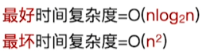

空间复杂度=O(递归层数)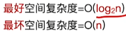

**算法不稳定**

### 8.4.1简单选择排序

> 每一趟从未排序的元素中 **选出最小的元素**，放到**已排序部分**的末尾

```c
void SelectSort(int a[],int n){
     for(int i=0;i<n-1;i++){//一共进行n-1次，最后一个不用管
          int min=i;
          for(int j=i+1;j<n;j++)
               if(a[min]>a[j])min=j;
          if(min!=i)swap(a[i],a[min]);
     }
}
void swap(int *a,int *b){//交换
     int temp=a;
     a=b;
     b=temp;
}
```

**算法不稳定**

空间复杂度O(1)

时间复杂度O(n^2^)

### 8.4.2堆排序

**堆排序（Heap Sort）** 是一种利用 **堆（Heap）这种数据结构** 实现的排序算法。

> 先把数组构建成一个 **大顶堆**，然后不断把堆顶元素（最大值）交换到数组末尾，再调整堆

堆是一种 **完全二叉树**,常见有两种

1️⃣ **大顶堆（Max Heap）**父节点 ≥ 子节点

2️⃣ **小顶堆（Min Heap）**父节点 ≤ 子节点

下坠调整函数

删除/插入

插入到堆底，上升

被删除元素用堆底代替，直到无法下坠

```c
void HaedAdjust(int a[],int k,int len){//调整成大根堆
     a[0]=a[k];//k是根，a[0]暂时存储根结点
     for(int i=2*k;i<=len;i*=2){//从左子树开始
          if(i<len&&a[i]<a[i+1])i+=1;//和右子树比较,i指向更大的那一个
          if(a[0]>=a[i])break;
          else{
               a[k]=a[i];//a[k]存的是最大值
               k=i;//继续往下面看子树对不对
          }
     }
     a[k]=a[0];//最大值是根
}
```

建立大根堆

```c
void BuildMaxHeap(int a[],int len){
     for(int i=len/2;i>0;i--)
          HeadAdjust(A,i,len);
}
```

堆排序

```c
void HeapSort(int a[],int len){
     BuildMaxHeap(A,len);
     for(int i=len;i>1;i--){
          swap(a[i],a[1]);//堆顶和堆底交换
          HeadAdjust(A,1,i-1);//剩余的继续
     }
}
```

### 8.5.1归并排序

（Merge Sort）m路归并，选出一个元素至少要对比m-1次

**分解（Divide）**
 将数组不断对半分，直到每个子数组只剩下 **1 个元素**（单个元素天然有序）。

**合并（Merge）**
 将两个已经排序好的子数组合并成一个新的有序数组

> 创造一个等大的数组b并复制a组内容，然后开始比较大小逐个放入a组组成新的有序数组

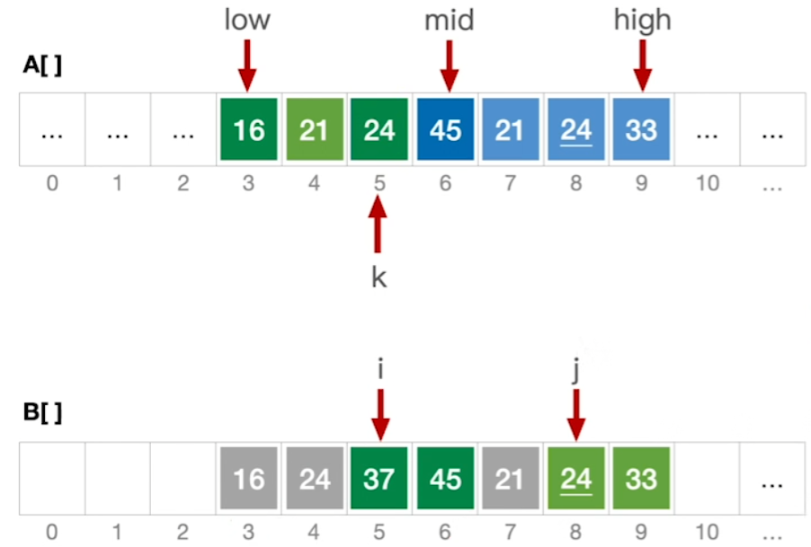

```c
int *b=(int *)malloc(sizeof(int)*n);//辅助数组b
void Merge(int a[],int low,int hign,int mid){
     int i,j,k;
     for(i=low;i<=hign;i++)b[i]=a[i];//复制
     for(i=low,j=mid+1,k=i;i<=mid&&j<=hign;k++){//小的值在a组，归并步骤
          if(b[i]<=b[j])a[k]=b[i++];//稳定
          else a[k]=b[j++];
     }
     while(i<=mid)a[k++]=b[i++];//如果没有遍历完就直接加进去
     while(j<=hign)a[k++]=b[j++];
}
void MergeSort(int a[],int low,int hign){
     if(low<hign){
          int mid=(low+hign)/2;
          MergeSort(a,low,mid);//左排序
          MergwSort(a,mid+1,hign);//右排序
          Merge(a,low,mid,hign);
     }
}
```

### 8.5.2基数排序

（Radix Sort）

> 从低位到高位依次排序（LSD：Least Significant Digit）

按 **个位** 排序

按 **十位** 排序

按 **百位** 排序

…直到最高位

空间复杂度=O(r)

**算法稳定**

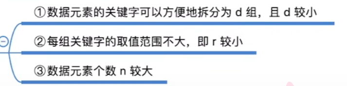

### 8.5.3计数排序

（Counting Sort）它通常用于 **整数且范围不大的数据**

> 先数一数每个数字出现多少次，再按顺序写出来

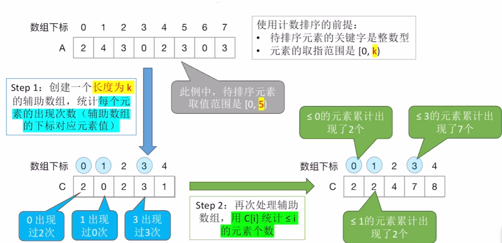


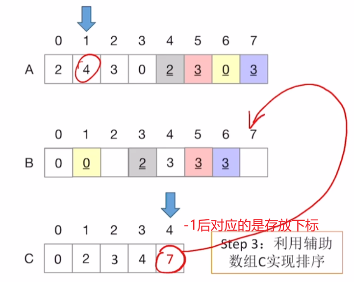


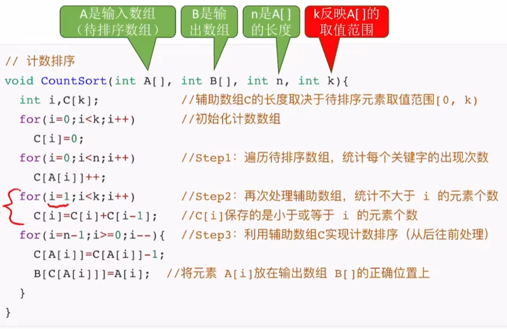

### 8.7.1外部排序

（External Sorting）当 **数据量太大，无法一次全部放入内存** 时，需要借助 **外部存储（通常是磁盘）** 来完成的排序方法。

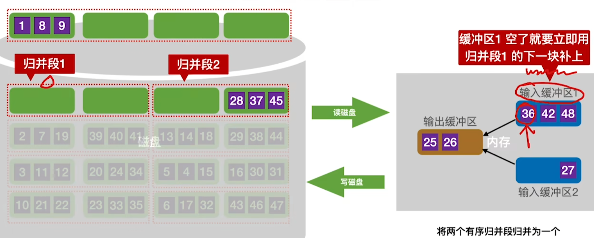

1️⃣ 分块排序（生成初始有序段）

>从磁盘读取一部分数据（能放进内存的大小）
>
>在内存中排序（用快速排序 / 归并排序）
>
>把排序好的结果写回磁盘


2️⃣ 多路归并（Merge）

> 然后把这些有序文件 **合并**。（图上是二路，更慢时间更长

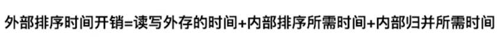

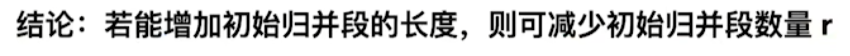

### 8.7.2败者树

**（Loser Tree）**是一种用于 **多路归并（k-way merge）** 的数据结构，常见于 **外部排序** 中，用来提高归并效率。

> 败者树 = 用来快速找到多个序列中最小值的一种比赛树结构。


### 8.7.4置换-选择排序

**（Replacement Selection Sort）**是一种用于 **外部排序** 的技术，主要作用是：

> **在生成初始有序段时，让每个有序段尽可能长。**

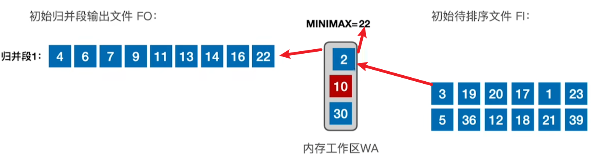


### 8.7.5最佳归并树

（Optimal Merge Tree）

> 当有多个有序段需要归并时，怎样安排归并顺序，才能使总的归并代价最小

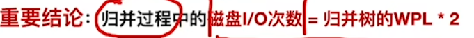

