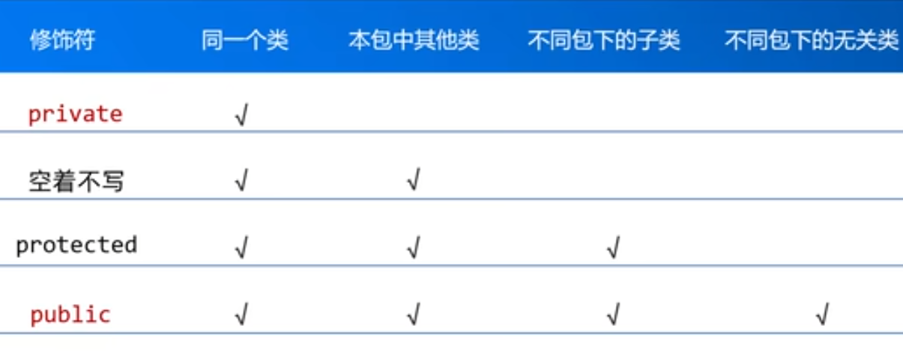
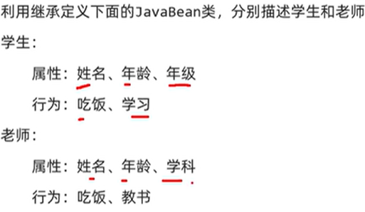
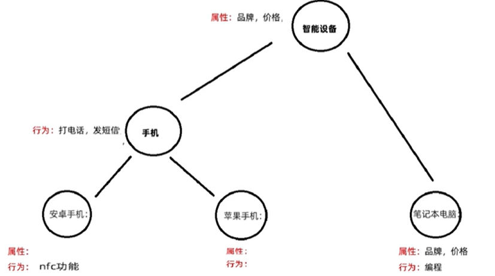
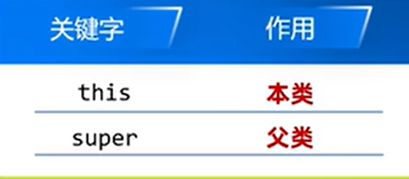
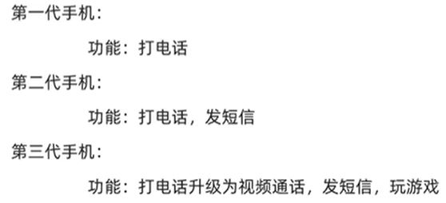
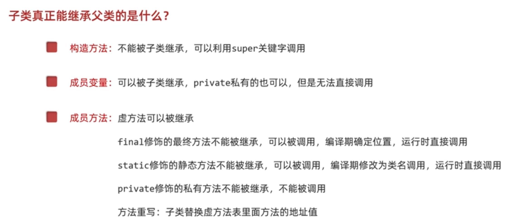
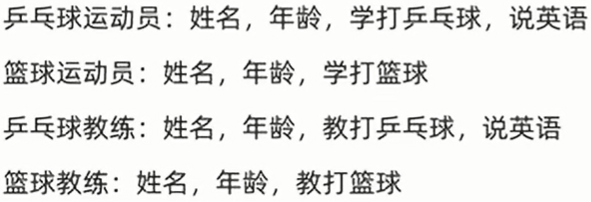
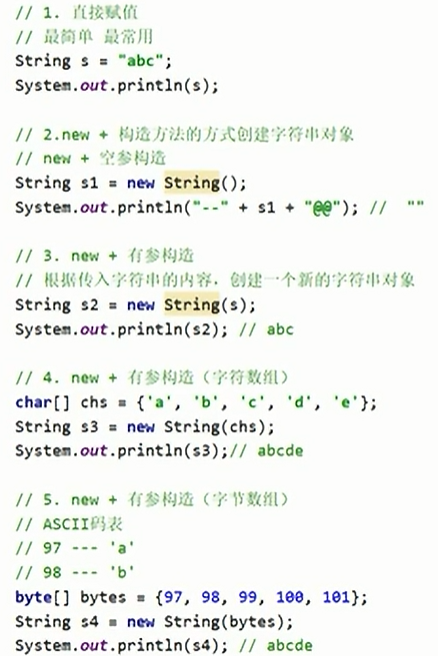

# JAVA

## 初始java

**Java** 是一种非常流行的 **面向对象编程语言（Object-Oriented Programming Language）**，主要用于开发企业级应用、网站后台、Android 应用等。

src是源代码，文件都在src中

**快捷键**

单行注释ctrl+/ 多行注释ctrl+/

alt+p强制ai生成代码

ctrl+alt+v自动生成左边

alt+enter自动修复代码

alt+insert构造

ctrl alt l格式化代码

//package表示当前的类定义在那一个包下

class表示一个类，后面跟着的是类的名字，代码在{}中

双引号表示字符串形式

**切换到低版本**

文件-项目结构-选择版本就可以选择比当前版本更低的编译器

### 构造方法

1. 没有构造方法会怎样？

```
public class Student {
    String name;
    int age;
}
```

你创建对象：

```
Student s = new Student();
```

结果：

-  name = null
-  age = 0

**全是空的、默认值，啥用没有。**

你必须手动赋值：

```
s.name = "小明";
s.age = 18;
```

**麻烦！啰嗦！容易忘！**

2. 有了构造方法，一步到位！


```
public class Student {
    String name;
    int age;

    // 构造方法
    public Student(String name, int age) {
        this.name = name;
        this.age = age;
    }
}
```

创建对象时**直接赋值**

```
Student s = new Student("小明", 18);
```

✅ 名字有了

✅ 年龄有了

✅ 一行搞定

**这就是构造方法的作用！**


### 面向对象

```c
class Student {
    String name;
    int age;

    void study() {
        System.out.println(name + "在学习");
    }
}
```

创建对象

```c
Student s = new Student();
s.name = "张三";
s.age = 18;

s.study();

```

构造方法

```c
class Student {
    String name;
    int age;

    Student(String n, int a) {
        name = n;
        age = a;
    }
}
```

**类 (Class)**：可以理解成一个 “模板” 或 “蓝图”，比如你写的 `Student` 类就是 “学生” 这个事物的模板。

**方法 (Method)**：就是这个模板里定义的 “行为 / 动作”—— 学生能做什么？比如学习、吃饭、睡觉，对应到代码里就是 `study()`、`eat()`、`sleep()` 这类方法。

类 = 属性（特征：名字、年龄） + 方法（行为：学习）

### 虚方法表

虚方法表只包含 **非 static、非 final、非 private** 的实例方法

##### 虚方法表的作用

-  它是 Java 实现 ** 多态（动态绑定）** 的核心机制：JVM 在运行时，会根据对象的实际类型，去对应的虚方法表里找方法地址，执行真正的方法。
-  只有进入虚方法表的方法，才支持**方法重写（Override）**。重写的本质，就是子类把虚方法表里父类方法的内存地址，替换成自己的方法地址。

## 高级

**面向对象三大特征**：封装，继承，多态

### 权限修饰符

作用范围由小到大 (private < 空着不写 < protected<public



### 封装

**（Encapsulation）核心思想：隐藏内部细节，对外提供接口**

- 把数据（属性）和操作数据的方法（函数）封装在一个类中
- 外部不能随意直接访问内部数据，只能通过方法操作

**好处**

- 提高安全性（防止数据被乱改）

- 降低耦合（内部改动不影响外部）

  

  ```c
  public class Student {
      private String name;
      private int age;
      private double height;
      private double weight;
      ...
  }
  public void printStu(Student stu){
      System.out.println(stu.getName());
      System.out.println(stu.getAge());
      System.out.println(stu.getHeight());
      System.out.println(stu.getWeight());
  }
  ```

  

### 继承

[继承](一个例子学会带有继承结构的标准JavaBean类.md)

**（Inheritance）核心思想：子类复用父类的代码**

- 一个类（子类）可以继承另一个类（父类）的属性和方法
- 可以在继承的基础上扩展或修改功能



#### 简单

先建一个父类person

```c
public class Person {
    String name;
    int age;

    public void eat(){
        System.out.println("吃饭~");
    }
}
```

建一个子类student

```c
public class Student extends Person{//认person为父
    // 特有的内容
    // 属性：年级
    String grade;

    // 行为：学习
    public void study(){
        System.out.println("学生在学习");
    }
}
```

建一个子类teacher

```c
public class Teacher extends Person{
    // 子类特有的内容
    // 属性：学科
    String subject;

    // 行为：教书
    public void teach(){
        System.out.println("老师在教书");
    }
}
```

然后再建一个main类psvm

```c
public class Test {
    public static void main(String[] args) {
        // 创建对象
        Student s = new Student();
        s.name = "小诗诗";
        s.age = 19;
        s.grade = "一年级";

        System.out.println(s.name + ", " + s.age + ", " + s.grade);
        s.eat();
        s.study();

        System.out.println("-------------------------");

        // 创建老师的对象
        Teacher t = new Teacher();
        t.name = "阿玮老师";
        t.age = 20;
        t.subject = "计算机学科";
        System.out.println(t.name + ", " + t.age + ", " + t.subject);
        t.eat();
        t.teach();
    }
}
```

#### 进阶



画图：从下往上 写代码：从上往下

```c
public class SmartDevice {
    // 属性:
    String brand;
    double price;
}
```

```c
public class Phone extends SmartDevice{
    // 行为
    public void call(){
        System.out.println("利用手机打电话");
    }

    public void sendMessage(){
        System.out.println("利用手机发短信");
    }
}
```

```c
public class Android extends Phone{
    public void NFC(){
        System.out.println("安卓手机可以使用NFC功能");
    }
}
```

```c
public class IOS extends Phone{
}
```

```c
public class Laptop extends SmartDevice{
    public void coding(){
        System.out.println("利用笔记本电脑进行编程");
    }
}
```

```c
// 创建安卓手机的对象
Android a = new Android();
a.brand = "魅族";
a.price = 1999;
System.out.println(a.brand + ", " + a.price);
a.call();
a.sendMessage();
a.NFC();

// 创建苹果手机的对象
IOS i = new IOS();
i.brand = "苹果";
i.price = 5999;
System.out.println(i.brand + ", " + i.price);
i.call();
i.sendMessage();
```

#### 成员特点

**Java 只支持单继承，不支持多继承，但支持多层继承。**

不能多继承：子类不能继承多个父类 

单继承：一个子类只能继承一个父类

**直接继承的父类叫做直接父类，间接继承的爷爷叫做间接父类**

**Java 中所有的类都直接或者间接继承于Object类**

##### 成员变量



```c
public class Fu {
    String name = "Fu";
}

public class Zi extends Fu{
    String name = "Zi";
    public void show(){
        String name = "ziShow";
        System.out.println(name);      // 输出：ziShow
        System.out.println(this.name); // 输出：Zi
        System.out.println(super.name);// 输出：Fu
    }
}
```

##### 成员方法

```c
public void lunch(){
    // 吃米饭，吃菜，喝开水
    eat(); // this.eat();
    drink(); // this.drink();
    System.out.println("---------------------");
    super.eat();
    super.drink();
}
```

**方法重写（Override）**

1. 定义

**方法重写**：在子类中重新实现父类的方法，**方法声明必须与父类保持完全一致**（方法名、参数列表、返回值类型需兼容），仅修改方法体逻辑。

2. 使用场景

当父类的方法实现无法满足子类的业务需求时，子类可以对该方法进行重写，从而实现子类特有的行为



```c
public class FirstGenerationPhone {

    public void call() {
        System.out.println("利用手机打电话");
    }

}
```

```c
public class SecondGenerationPhone extends FirstGenerationPhone {

    public void sendMessage() {
        System.out.println("利用手机发短信~");
    }

}
```

```c
public class ThirdGenerationPhone extends SecondGenerationPhone {

    // 注解/注释：都是对代码的解释说明
    // 注释：给程序员看的（文字性的内容）
    // 注解：给虚拟机看的
    @Override
    public void call() {
        System.out.println("开启视频~");
        System.out.println("利用手机打电话~");
    }

}
```

**完全重写（不使用父类代码）**

如果父类方法的实现完全不符合子类需求，**直接在子类中重写整个方法体**，不再调用父类的任何代码。

**扩展重写（保留父类代码 + 新增逻辑）**

如果需要在父类功能基础上做增强，使用 `super.父类方法名()` 先调用父类原有逻辑，再添加子类新逻辑。

**方法重写注意事项和要求**：

**方法名、形参列表**必须和父类保持一致，只有**方法体**不同。

子类重写方法的**访问权限**需要**大于等于**父类方法的访问权限。

子类重写方法的**返回值类型**需要**小于等于**父类方法的返回值类型。

建议：**方法声明**和父类保持一致。

`final` 修饰的类是最终类，**不能被重写**。

##### 构造方法

- 父类中的构造方法不会被子类继承，只能通过 super 关键字调用

- 如果子类的构造方法不写 super，JVM 也会加一个默认的 super ()，先访问父类的无参构造

  

  ```c
  public class Student extends Person{
      String grade;
  
      // 构造方法
      // 1.空参构造
      public Student(){
          System.out.println("子类Student的空参构造执行了~");
      }
      // 2.带全部参数构造（父 + 子）
      public Student(String name, int age, String grade){
          // 父类中的属性：通过super（参数）的形式传递给父类的构造方法赋值
          super(name,age);
          // 子类中的属性：自己赋值
          this.grade = grade;
      }
  }
  ```

  #### 1. final 修饰的方法
  
  -  **核心特性**：**不能被重写（Override）**，子类可以继承调用，但无法修改其实现。
  -  **编译期**：编译器会遍历继承链，确定该方法的定义位置（如类 A），并记录方法地址。
  -  **运行期**：直接执行编译期确定的方法，避免了动态绑定开销，**运行效率更高**，但编译阶段耗时稍长。
  
  ------
  
  #### 2. static 修饰的方法
  
  -  **核心特性**：**属于类本身，不参与继承的多态**，子类可以定义同名方法，但本质是 “隐藏” 而非重写。
  -  **编译期**：编译器会遍历继承链确定方法归属类，并将对象调用形式（如 `obj.method()`）直接改写为类名调用形式（如 `A.method()`）。
  -  **运行期**：直接执行类方法，无动态绑定过程，执行效率高。
  
  

### 多态

在 Java 中，多态指：

👉 **同一个方法调用，由不同对象执行时，产生不同的行为**

1.  变量调用：编译看左边，运行也看左边

2. ```c
   class Parent { int num = 10; }
   class Child extends Parent { int num = 20; }
   Parent p = new Child();
   System.out.println(p.num); // 输出 10，编译和运行都看左边 Parent 类型
   ```

   

3. 方法调用：编译看左边，运行看右边

4. ```c
   class Parent { void show() { System.out.println("Parent"); } }
   class Child extends Parent { void show() { System.out.println("Child"); } }
   Parent p = new Child();
   p.show(); // 输出 Child，编译看 Parent 存在 show 方法，运行看 Child 实际对象
   ```


1.  多态的弊端 💡

多态的核心弊端是：**父类引用无法直接调用子类的特有功能**。

-  当使用父类引用指向子类对象时，只能访问父类中定义的方法，无法直接调用子类中独有的、未在父类声明的方法。
-  若要使用子类特有功能，必须通过类型转换来实现。

2. 引用数据类型的类型转换方式 📌

引用数据类型的类型转换主要分为两种：

1. 自动类型转换（向上转型）

   -  由子类类型自动转换为父类类型，无需显式声明。
   -  本质是 “将小范围类型转为大范围类型”，安全且不会报错。
   -  例如：`Animal animal = new Cat();`（Cat 是 Animal 的子类）。

   

2. 强制类型转换（向下转型）

   -  由父类类型强制转换为子类类型，必须显式声明。
   -  本质是 “将大范围类型转为小范围类型”，存在类型安全风险。
   -  例如：`Cat cat = (Cat) animal;`（animal 需实际指向 Cat 对象）。

   

3. 强制类型转换的作用与注意事项 ⚠️

解决的问题

-  可以将父类引用还原为真实的子类类型，从而**调用子类中独有的功能**，弥补多态的弊端。

注意事项

1. 类型匹配要求

   ：如果要转换的目标类型与对象的真实类型不一致，会抛出 

   ```
   ClassCastException
   ```

    类型转换异常。

   -  例如：`Animal animal = new Cat(); Dog dog = (Dog) animal;` 会报错，因为 animal 实际是 Cat 对象。

   

2. 类型安全检查

   ：在转换前，应使用 

   ```
   instanceof
   ```

    关键字判断对象是否属于目标类型，避免运行时异常。

   ```
   if (animal instanceof Cat) {
       Cat cat = (Cat) animal;
       cat.catSpecificMethod();
   }
   ```

   

   

### 抽象类

抽象方法:将共性的行为(方法)抽取到父类之后。因为为每一个子类的方法体是不一样,所以,在父类中不能确定具体的方法体。该方法就可以定义为抽象方法。
抽象类:如果一个类中存在抽象方法,那么该类就必须声明为抽象类


注意点1:抽象类不能实例化
        注意点2:抽象类中不一定有抽象方法,有抽象方法的类一定是抽象类
        注意点3:抽象类中可以有构造方法
        注意点4:抽象类的子类
要么重写抽象类中的所有抽象方法
要么子类也是抽象类

### 接口

接口中成员的特点
成员变量:只能是常量。默认修饰符:public static final

```c
int A=10;
```

构造方法:没有
成员方法:只能是抽象方法。默认修饰符:publicabstract
JDK7以前:接口中只能定义抽象方法
JDK8的新特性:接口中可以定义有方法体的方法
JDK9的新特性:接口中可以定义私有方法


类和类的关系
维承关系,只能单继承,不能多维承,但是可以多层继承
类和按口的关系
实现关系,可以单实现,也可以多实现,还可以在继承一个类的同时实现多个按口
注意点:
1.如果父类Person也是一个抽象类的话,那么在子类当中,需要把所有的抽象方向进行抽象,要么子类本身也是一个抽象类
2.如果在重写的时候出现了重复的抽象方法,此时我们只要重写一次就可以了
按口和按口的关系
继承关系,可以单继承,也可以多继承
注意点:
1.如果有一个按口A维承了多个按口,此时相当于是把多个按口中的抽象方法全部维承下来了
在以后,实现类实现按口A的时候,就要把所有的抽象方法进行重写


#### 一个例子学会抽象类和接口



这是因为它继承了 Person 类，自动获得了父类的属性和方法！

```c
package com.brain.ooptest1;

public abstract class Person {
    private String name;
    private int age;

    public Person() {
    }

    public Person(String name, int age) {
        this.name = name;
        this.age = age;
    }

    public String getName() {
        return name;
    }

    public void setName(String name) {
        this.name = name;
    }

    public int getAge() {
        return age;
    }

    public void setAge(int age) {
        this.age = age;
    }
}

```

```c
package com.brain.ooptest1;

public class PingpangCoach extends  Coach implements English{
    public PingpangCoach() {
    }

    public PingpangCoach(String name, int age) {
        super(name, age);
    }

    @Override
    public void teach() {
        System.out.println("乒乓教练在教ennis");
    }

    @Override
    public void speak() {
        System.out.println("乒乓教练在学英语");
    }
}

```

```c
package com.brain.ooptest1;

public class PingPangSporter extends Spoter implements English{

    public PingPangSporter() {
    }

    public PingPangSporter(String name, int age) {
        super(name, age);
    }

    @Override
    public void study() {
        System.out.println("乒乓运动员在学pingpang");
    }

    @Override
    public void speak() {
        System.out.println("乒乓运动员在学英语");
    }
}

```

```c
package com.brain.ooptest1;

public abstract class Spoter extends Person{
    public Spoter() {
    }

    public Spoter(String name, int age) {
        super(name, age);
    }
    public abstract void study();//抽象方法没有方法体也就是大括号
//    抽象方法的目的是定义规范，而不是实现功能：
//    它告诉子类："你必须实现这个方法"
//    具体的实现逻辑由子类决定
//    父类只定义"做什么"，不关心"怎么做"
//
}

```

```c
package com.brain.ooptest1;

public class Test {
    public static void main(String []args) {
        PingPangSporter pps = new PingPangSporter("小王", 18);
        System.out.println(pps.getName() + " " + pps.getAge());
        pps.study();
        pps.speak();

    }
}

```


#### 默认方法

当一个接口升级的时候，它的实现类也要改变，所以这个时候出现了**有方法体的方法**解决了这个问题

格式：`public default void show(){}`

作用：为了接口升级的时候代码不报错

**特点**：

-  有**方法体**（传统接口方法只有声明）

-  实现类**无需强制重写**，可直接继承使用

-  实现类可**选择重写**以自定义行为，重写时去掉default

-  public可以省略，default不能省略

-  存在相同名字的，子类必须重写

   

   ❌ 接口静态方法**不能被实现类重写**

   >  此时相当于接口和实现类里面刚好有两个同名的方法而已，但是不构成重写关系

   

jdk9:新增了私有的方法
//普通的私有方法:private返回值类型方法名(形参){方法体}
//静态的私有方法:privatestatic返回值类型 方法名(形参){方法体}


### 内部类

#### 定义

##### **1.什么是内部类?**

写在一个类里面的类就叫做内部类

##### 2.什么时候用到内部类?

一个类表示的事物是另一个类的一部分,且单独存在没有意义
比如:汽车的发动机,人的心脏等等

#### 分类

##### 成员内部类

-  写在成员位置的,属于外部类的成员

-  成员内部类可以被一些修饰符所修饰,比如:private,默认,protected,public,static等

   

   ```c
   public class Car {外部类
   
   String carName;
   
   int carAge;
   
   int carColor;
   
   protected class Engine {成员内部类
   
   String engineName;
   
   int engineAge;
   
   }
                    }
   ```

   

   调用内部类的方法

   ```c
   
   
   public class Outer{
        private int a=10;
        class Inner{
              private int a=20;
             public void show(){
                   int a=30;
                       sout10---Outer.this.a
                            //看视频112了解内涵
                       sout 20---this.a
                       sout 30---a
                            
             }
        }
   }
   测试类：
   public class Test{
        public static void main(String[]args){
             Outer.Inner oi=new Outer().new Inner();
             oi.show();
        }
   }
   ```

   

##### 静态内部类

静态内部类也是成员内部类的一种

-  静态内部类只能访问外部类中的**静态变量和静态方法**

-  如果在静态内部类中,想要访问外部类非静态的内容,需要创建外部类的对象

```c
public class Car {外部类
  String carName;
  int carAge;
  int carColor;
  static class Engine{静态内部类
  public void show(){
  sout(carName);
  }
}
```

//创建静态内部类的对象
       //只要是静态的东西,都可以用类名点直接获取

调用静态方法不用创建对象——————`Outer.Inner.show2();`

##### 局部内部类

1.将内部类定义在方法里面就叫做局部内部类,类似于方法!里面的局部变量。
        2.外界是无法直接使用局部内部类,需要在方法内部创建对象并使用
        3.该类可以直接访问外部类的成员,也可以访问方法内的局部变量。

##### 匿名内部类

匿名内部类的定义格式:
              new类名/接口名(){
                     重写类/接口里面的方法;
              }
匿名内部类的定义格式=没有名字的java类+继承/实现+重写方法+创建对象
最终格式可以理解为:是一个没有名字的java类的对象


## API

API (Application Programming Interface):应用程序编程接口
简单理解:就是JDK提供的各种功能的Java类。我们不需要自己编写,直接使用即可
这些类将底层的实现封装了起来,我们不需要关心这些类是如何实现的,只要学会如何使用

### 输入输出/时间

#### sc.next()

`sc.next()` = 读取控制台输入的一段文本（字符串）

1.**只读取 不含空格 的内容**

输入：`zhang san` → 只会读到 `zhang`，空格后面的内容会被截断

2.**以 空格 / 回车 / Tab 作为结束标志**

3.**返回值是字符串**，所以必须用 `String` 变量接收

4.**不会读取换行符**


#### nextInt(n)

```c
// 1. 无参：生成一个随机 int（范围：整个 int 取值区间，正负都有）
int num = r.nextInt();

// 2. 带参：生成 [0, bound) 区间的随机 int（0 ≤ 结果 < bound）
int num = r.nextInt(bound);
//区间规则：左闭右开，nextInt(n) 生成 [0, n) 的整数
//常见场景：生成指定范围的随机数，比如验证码、抽奖、游戏随机事件等
```

##### currentTimeMillis()

```c
long start = System.currentTimeMillis();
long end = System.currentTimeMillis();
// 计算耗时（单位：毫秒）
System.out.println("执行耗时：" + (end - start) + "ms");
```

这行代码的核心作用是**获取当前系统时间的毫秒数**，通常用于**统计代码执行耗时**

### 字符串（String）

#### 替换

##### str.replace()

字符串替换方法

```c
String s = "hello";
String res = s.replace('l', 'L'); 
System.out.println(res); // 输出：heLLo

String s = "hello world, hello java";
// 替换所有 "hello" 为 "hi"
String res = s.replace("hello", "hi"); 
System.out.println(res); 
// 输出：hi world, hi java
```

```c
String.join( 连接符 , 集合/数组 )
String.join("/", "a", "b", "c")
"a/b/c"
```


#### 判断

##### str.equals()

比较两个字符串内容**是否完全一致**的方法，**区分大小写**。

整个表达式会返回一个`boolean`值

`equals()`严格区分大小写

>  **不要用 `==`比较字符串**：`==`比较的是对象引用（内存地址），而非内容，只有两个字符串是同一个对象时才会返回`true`，绝大多数场景应使用`equals()`

```c
String a = "你好";
String b = "你好";
System.out.println(a.equals(b)); // true （内容一样）
```


##### str.equalsIgnoreCase()

忽略大小写比较,只看内容，**不看大写小写**

```c
String s1 = "Hello";
String s2 = "hello";
System.out.println(s1.equalsIgnoreCase(s2)); // true
```

##### contains()

检查当前字符串是否包含指定的子串，区分大小写

```c
String str = "Hello Java";
System.out.println(str.contains("Java"));  // true
System.out.println(str.contains("java"));  // false（大小写敏感）
```

参数支持 `String`、`StringBuilder` 等字符序列

##### startsWith()

判断字符串是否以指定前缀开头，区分大小写

```c
String url = "https://www.baidu.com";
System.out.println(url.startsWith("https")); // true
System.out.println(url.startsWith("http"));  // true
System.out.println(url.startsWith("ftp"));   // false
```

##### endsWith()

判断字符串是否以指定后缀结尾，区分大小写

```c
String fileName = "test.java";
System.out.println(fileName.endsWith(".java")); // true
System.out.println(fileName.endsWith(".txt"));  // false
```

##### isEmpty()

判断字符串长度是否为 0

```c
String str1 = "";
String str2 = " ";
String str3 = null;

System.out.println(str1.isEmpty());  // true（空字符串）
System.out.println(str2.isEmpty());  // false（空格是有效字符，长度为1）
// System.out.println(str3.isEmpty()); // 报错：空指针异常（NullPointerException）
```


####  查找 / 获取

##### length()

```c
int len = str.length();
System.out.println(len);
```


##### indexOf()

`indexOf()` 就是：在字符串里找字符 / 找字符串，找到了返回【位置】，没找到返回【-1】。

```c
假设 VOWEL = "aeiou"
VOWEL.indexOf('a') → 返回 0
VOWEL.indexOf('e') → 返回 1
VOWEL.indexOf('u') → 返回 4 
VOWEL.indexOf('b') → 返回 -1
VOWEL.indexOf('x') → 返回 -1
```

##### lastIndexOf()

用于**反向查找**字符或子串最后一次出现的索引。

```c
String str = "abacaba";
// 查找字符 'a' 最后一次出现的位置
int index = str.lastIndexOf('a'); 
System.out.println(index); // 输出：6 (字符串索引从0开始，最后一个'a'在第7位)
String str = "hello world, hello java";
// 查找 "hello" 最后一次出现的位置
int index = str.lastIndexOf("hello");
System.out.println(index); // 输出：13 (第二个"hello"的起始位置)
String str = "test";
int index = str.lastIndexOf("xyz");
if (index == -1) {
    System.out.println("未找到指定内容");
}
String str = "abcabcabc";
// 从索引5的位置开始，向前找 "abc"
int index = str.lastIndexOf("abc", 5);
System.out.println(index); // 输出：3 (只搜索0-5范围内的内容)
```


##### charAt()

**获取字符串中指定索引位置的单个字符**

```c
String str = "Hello World";
        // 获取索引0的字符（第一个字符）
        char c1 = str.charAt(0);
        System.out.println(c1); // 输出：H
        
```

##### lastIndexOf()


#### 截取 / 转换

##### substring()

```
字符串.substring(起始索引, 结束索引);
```

-  **索引规则**：Java 字符串索引从 `0` 开始计数
-  **区间规则**：**左闭右开**，即包含「起始索引」的字符，**不包含**「结束索引」的字符
-  本代码含义：从索引 `i` 开始，截取到索引 `i+8`（不包含 `i+8`），最终截取 **8 个字符**

```c
String str = "abcdefghijklmn";
int i = 2;
// 从索引2开始，截取到索引10（不包含10），共8个字符
String sub = str.substring(i, i + 8); 
System.out.println(sub); // 输出：cdefghij
```

##### **toCharArray()**

**将字符串转换为字符数组**

```c
 String str = "Hello";
 char[] charArray = str.toCharArray();
```

（1）直接目的

把字符串 `S`（比如 `"abciiidef"`）转换成一个字符数组 `s`，转换后：

- `s[0]` 对应 `S` 的第 0 个字符（`'a'`）
- `s[1]` 对应 `S` 的第 1 个字符（`'b'`）
- 以此类推，通过数组索引可以直接访问单个字符。

（2）性能优化（关键原因）

Java 中的 `String` 是**不可变对象**，且通过 `charAt(int index)` 访问单个字符时，底层会做「范围检查」等额外操作；而字符数组 `char[]` 是直接的内存连续存储，通过索引访问的效率更高。

对于需要**频繁访问单个字符**的场景（比如滑动窗口遍历字符串），转换为字符数组能显著减少方法调用开销，提升执行效率。

（3）代码简洁性

转换后可以用 `s[i]` 代替 `S.charAt(i)`，代码更简洁，尤其是在多次访问字符的循环中（比如原代码中判断元音的逻辑）。

**Integer[] a = nums.toArray(Integer[]::new);**

“帮我创建一个 Integer 类型的数组，大小你自己决定”


##### toUpperCase()

将字符串中**所有英文字母转为大写**

```c
String str = "Hello Java 123!";

// 转大写
String upper = str.toUpperCase();
System.out.println(upper); // 输出: HELLO JAVA 123!
```


##### toLowerCase()

将字符串中**所有英文字母转为小写**

```c

// 转小写
String lower = str.toLowerCase();
System.out.println(lower); // 输出: hello java 123!
```

#### Integer.parseInt(x)

`Integer` 类的静态方法，作用是**把字符串 `x` 解析为 `int` 类型的整数**

```c
ans.add(Integer.parseInt(x));
```


#### 格式化

##### trim()

```c
// 基础用法：去除首尾空格
String str = "  Hello Java  ";
String trimmed = str.trim();
System.out.println(trimmed); // 输出: "Hello Java"（首尾空格被清除）

// 中间空格保留
String str2 = "  a b c  ";
System.out.println(str2.trim()); // 输出: "a b c"（中间空格不变）

// 无首尾空格时，返回原字符串
String str3 = "test";
System.out.println(str3.trim() == str3); // 输出: true（JVM 字符串池优化）
```


### 字符串工具类

#### StringBuilder()

```c
 // 1. 创建对象
        StringBuilder sb = new StringBuilder("Hello");//带初始化字符串

StringBuilder sb = new StringBuilder(str);
//声明一个 StringBuilder 类型的变量 sb
//用已有字符串 str 初始化一个新的 StringBuilder 对象
///最终 sb 中存储的内容，和 str 完全一致

// 2. append()：拼接（支持字符串、数字、字符等所有类型）
        sb.append(" ");
        sb.append("Java");
        sb.append(123);
        System.out.println(sb); // 输出：Hello Java123
// 3. insert()：索引2处插入"Hi"
        sb.insert(2, "Hi");
        System.out.println(sb); // 输出：HeHillo Java123

        // 4. delete()：删除索引2~4的字符（左闭右开）
        sb.delete(2, 4);
        System.out.println(sb);

// 输出：Hello Java123
        sb.deleteCharAt(下标);
//就是字符的位置编号，从 0 开始数：

        // 5. replace()：替换索引6~9为"Python"
        sb.replace(6, 10, "Python");
        System.out.println(sb); // 输出：Hello Python123

        // 6. reverse()：反转字符串
        sb.reverse();
        System.out.println(sb); // 输出：321nohtyP olleH

        // 7. 转回String（最终需要字符串时调用）
        String result = sb.toString();
        System.out.println(result); // 输出：321nohtyP olleH
    //8.int len=str.length;

```

#### StringBuffer()

StringBuilder 更快，但线程不安全；

StringBuffer 慢一点，但线程安全。

写算法题 → 永远用 StringBuilder！

```c
① append (字符) → 往口袋里加东西
java
root.append(c);
就相当于：
词根 = 词根 + 字符
但效率高得多！
② toString () → 把口袋里的内容变成正常字符串
java
return root.toString();
拼接完了，要返回结果了，就把它变成普通 String。
```


#### Character

##### 一、核心特性

-  **不可继承**：`final` 类，不可被继承。
-  **不可变对象**：`Character` 对象一旦创建，其值不可修改。
-  **自动装箱 / 拆箱**：`char` ↔ `Character` 可自动转换。
-  **Unicode 兼容**：基于 Unicode 标准定义字符属性Oracle。

##### 二、创建对象

```c
// 构造方法（Java 9 后不推荐）
Character ch1 = new Character('A');
// 推荐：静态工厂方法（缓存常用字符，性能更好）
Character ch2 = Character.valueOf('a');
// 自动装箱
Character ch3 = '中';
```

##### 方法

判断

| 方法                       | 功能                           | 示例                                    |
| -------------------------- | ------------------------------ | --------------------------------------- |
| `isLetter(char ch)`        | 是否为字母                     | `Character.isLetter('A') → true`        |
| `isDigit(char ch)`         | 是否为数字                     | `Character.isDigit('5') → true`         |
| `isLetterOrDigit(char ch)` | 是否为字母 / 数字              | `Character.isLetterOrDigit('9') → true` |
| `isLowerCase(char ch)`     | 是否小写                       | `Character.isLowerCase('b') → true`     |
| `isUpperCase(char ch)`     | 是否大写                       | `Character.isUpperCase('Z') → true`     |
| `isWhitespace(char ch)`    | 是否空白（空格、制表、换行等） | `Character.isWhitespace(' ') → true`    |
| `isSpaceChar(char ch)`     | 是否 Unicode 空格字符          |                                         |

转换

| 方法                   | 功能                | 示例                               |
| ---------------------- | ------------------- | ---------------------------------- |
| `toLowerCase(char ch)` | 转小写              | `Character.toLowerCase('B') → 'b'` |
| `toUpperCase(char ch)` | 转大写              | `Character.toUpperCase('c') → 'C'` |
| `toString(char ch)`    | 转为长度 1 的字符串 | `Character.toString('x') → "x"`    |


### 集合框架 (Collections)

```c
① 最简单（推荐 90% 场景）
直接打乱，自动用系统随机数：
java
// 打乱 list 里的元素顺序
Collections.shuffle(list);
② 自定义随机种子（可复现洗牌结果）
传入自己的 Random 对象，相同种子会洗出相同顺序：
java
Random random = new Random(固定种子);
Collections.shuffle(list, random);
```


#### HashMap

**首先的首先**：你到底要不要用哈希表？？？

有一些数字是固定的，有一个范围，你为什么还要用哈比表而不是直接创建一个数组呢？？？

##### 什么是HashMap？

`HashMap<K, V>` 是 Java Collections Framework 中的一个类，用来存储**键值对（key-value）**数据。

-  **K（键）**：唯一标识
-  **V（值）**：对应的数据

也就是**根据键得到值**

##### 基本结构

🔹 导入 HashMap

`import java.util.HashMap;`

🔹 创建 HashMap

`HashMap<String, Integer> map = new HashMap<>();`

>  定义一个 HashMap，键是字符串(String)，值是整数(Integer)，并创建这个 HashMap 对象，变量名叫 map。

**进阶**

`Map<Integer, Integer> cnt = new HashMap<>(points.length, 1);`

   1.**`points.length`**

预先告诉 HashMap：“我大概要存 **points.length 个元素**”

→ 避免频繁扩容，**更快**

   2.**`1`**

负载因子（load factor），表示：“装满 100% 再扩容”

→ 进一步**节省内存、提升速度**

**这两个数字只是优化性能，不影响功能！**

##### 🔹 常用方法

###### 1. 添加元素（put）

```
map.put("apple", 10);
map.put("banana", 5);
```

**如果 key 不存在**

-  就会新增一条数据

**如果 key 已经存在**

-  会把原来的值覆盖掉

###### 2. 获取元素（get）

```
int value = map.get("apple"); // 10
```

key 不存在的情况 返回 null

###### 3. 删除元素（remove）

```
map.remove("banana");
```

🔹假设原来 map 是这样的：`{apple=10, banana=5}`

​      删除后变成：`{apple=10}`

🔹**`remove()` 是有返回值的！**

​       如果 `"banana"` 存在 👉 返回被删除的值（比如 `5`）

​       如果 `"banana"` 不存在 👉 返回 `null`

###### 4. 判断是否存在

```
map.containsKey("apple");   // true
map.containsValue(10);      // true
```

 **判断 Map 中是否存在某个 key**  返回值是 **boolean（布尔值）**

###### 5. 获取大小

```
map.size();
```

👉 **获取 Map 中“键值对”的数量**也就是**表示 map 中元素的个数**

🔥**key 不能重复**，所以说相同的key只计数一次

###### 6.`getOrDefault(key, 默认值)`

👉 如果有就返回，没有就用默认值

```
map.getOrDefault("张三", 0);  // 18
map.getOrDefault("王五", 0);  // 0
```

【**计数核心**】

`cnt.put(num, cnt.getOrDefault(num, 0) + 1);`：

详解如下：

🧩 第一步：`cnt.getOrDefault(num, 0)`

意思是：

👉 去 Map 里找 `num` 的次数

- 如果 **有** → 返回当前次数
- 如果 **没有** → 返回 `0`

🧩 第二步：`+ 1`

👉 表示“这个数字又出现了一次”

🧩 第三步：`cnt.put(...)`

👉 把新的次数 **存回去**

```c
Map<Integer, Integer> cnt = new HashMap<>();

for (int num : nums) {
    cnt.put(num, cnt.getOrDefault(num, 0) + 1);
}
```

###### 7.cnt.merge(a[i], 1, Integer::sum);

给 `a[i]` 这个数的次数 +1（如果没有就设为1）

`Integer::sum`：

```
👉 意思是：把“旧值 + 新值”
```

**merge**

cnt.merge(key, value, 规则)

✅ 情况1：key 不存在，2没有

```
cnt.merge(2, 1, ...)
```

👉 直接变成：2变1

```
2 → 1
```

✅ 情况2：key 已经存在，2键值对应3

```
2 → 3
```

再执行：

```
cnt.merge(2, 1, Integer::sum);
```

👉 变成：键值变成4

```
2 → 3 + 1 = 4
```

###### 8.`cnt.values()`

这行代码的作用是获取 `Map` 集合中所有的值，并以 `Collection` 的形式返回

```c
 for (int c : cnt.values()) {
            long k = (long) c * (c - 1) / 2;
            ans += s * k;
            s += k;
        }
```

###### 9.cnt.putIfAbsent()

```c
只有当指定的键（Key）不存在，或者当前映射的值为 null 时，才会将给定的键值对存入哈希表。
// putIfAbsent 等价于这段逻辑
if (!map.containsKey(key)) {
    map.put(key, value);
}
第一次放入 "name" 键，因为 Map 里没有，所以成功存入
 String result1 = map.putIfAbsent("name", "张三");
```


##### HashMap的应用

这里用力扣904来举例子

```c
class Solution {
    public int totalFruit(int[] fruits) {
        int ans = 0;
        int left = 0;
        Map<Integer, Integer> cnt = new HashMap<>();
        for (int right = 0; right < fruits.length; right++) {
            cnt.merge(fruits[right], 1, Integer::sum); // fruits[right] 进入窗口
            while (cnt.size() > 2) { // 不满足要求
                int out = fruits[left];
                cnt.merge(out, -1, Integer::sum); // fruits[left] 离开窗口
                if (cnt.get(out) == 0) {
                    cnt.remove(out);
                }
                left++;
            }
            ans = Math.max(ans, right - left + 1);
        }
        return ans;
    }
}


```

###### 想要看一个数字存在否？

如果需要设定初始值直接用第一个

```java
 int c = cnt.getOrDefault(k - x, 0);
```

```c
boolean exists = map.containsKey(5);
```

###### 修改一个数的键值？

使用put吧，添加也算修改

```c
 cnt.put(k - x, c - 1);
```

###### 键值++？

第一种：代码简洁、性能更好、并发更安全

```c
cnt.merge(x, 1, Integer::sum);
```

```c
cnt.put(num, cnt.getOrDefault(num, 0) + 1);
```

###### 看一个数出现了几次就用

`map.getOrDefault(x,0);`

#### TreeMap

##### 一、核心特性

1. 有序性

   不是保存插入顺序，而是按键的排序规则有序（如数字升序、字符串字典序，也可自定义倒序）。

2. 键的规则

   -  键必须**可比较**（要么实现 `Comparable` 接口，要么传入自定义比较器）；
   -  键**唯一**，重复键会覆盖旧值；
   -  键**不能为 `null`**（会抛空指针异常），值可以为 `null`、可以重复。

   

3. 底层实现

   基于红黑树（自平衡的二叉查找树），保证了排序和高效的增删查。

4. 性能

   增删改查时间复杂度：O(log n)比 HashMap 的 O(1)慢

5. 线程不安全

   多线程环境下不能直接使用，需手动加锁或用 ConcurrentSkipListMap

   。

##### 基本用法

###### 1. 创建 TreeMap

存储 `键(Key) - 值(Value)`，键会**自动排序**（不能为 null）

```
import java.util.TreeMap;

public class TreeMapDemo {
    public static void main(String[] args) {
        // 创建：键是 Integer，值是 String
        TreeMap<Integer, String> treeMap = new TreeMap<>();
    }
}
```

###### 2. 添加数据（put）

用 `put(键, 值)` 方法添加，重复键会**覆盖旧值**。

```
// 乱序添加
treeMap.put(3, "香蕉");
treeMap.put(1, "苹果");
treeMap.put(2, "橙子");

// 重复键，覆盖旧值
treeMap.put(1, "红苹果");
```

###### 3. 获取数据（get）

用 `get(键)` 取对应的值，键不存在返回 `null`。

```
// 获取键 1 对应的值：红苹果
String value = treeMap.get(1);
System.out.println(value);
```

###### 4. 遍历（最常用两种方式）

TreeMap 遍历**默认按键升序**输出。

方式 1：遍历键 + 取值

```
// 遍历所有键
for (Integer key : treeMap.keySet()) {
    System.out.println("键：" + key + "，值：" + treeMap.get(key));
}
```

方式 2：直接遍历键值对（推荐）

```
// 遍历所有键值对
for (var entry : treeMap.entrySet()) {
    System.out.println(entry.getKey() + " = " + entry.getValue());
}
```

###### 5. 常用方法（记这 6 个就够）

```
// 1. 判断是否包含某个键
treeMap.containsKey(2); // true

// 2. 删除指定键的数据
treeMap.remove(3);

// 3. 获取集合大小
treeMap.size(); // 2

// 4. 获取第一个键（最小键）
treeMap.firstKey();

// 5. 获取最后一个键（最大键）
treeMap.lastKey();

// 6. 清空所有数据
treeMap.clear();
```

##### 和HashMap有什么区别

| 对比维度     | HashMap                        | TreeMap                           |
| ------------ | ------------------------------ | --------------------------------- |
| **底层结构** | 数组 + 链表 + 红黑树           | **纯红黑树**                      |
| **数据顺序** | **完全无序**（不保证任何顺序） | **按键自动排序**（升序 / 自定义） |
| **执行速度** | **极快** O(1)                  | 较慢 O (log n)                    |
| **null 键**  | 允许 **1 个 null 键**          | **不允许 null 键**（抛异常）      |
| **键的要求** | 无任何要求                     | 键**必须可比较**                  |
| **特有功能** | 无                             | 支持**排序、范围查询**            |
| **所属接口** | Map 接口实现                   | Map 接口实现                      |
| **线程安全** | 不安全                         | 不安全                            |


#### HashSet

##### 什么是HashSet?

👉 **HashSet 本质就是一个“只存 key 的 HashMap”**

| 结构    | 实际存储    |
| ------- | ----------- |
| HashSet | key         |
| HashMap | key + value |

这张图我们就可以知道HashSet只能记录所求Key有没有出现过，但是不会记录键值（例如出现次数等）

而HashMap功能更加齐全，无论是出现否还是计数都可以干

##### HashSet的特点

❗ **不允许重复**：

相同的元素只能存在一个 重复元素会被自动忽略

❗ **无序**：

例如：

```c
set.add(3);
set.add(1);
set.add(2);

System.out.println(set);
```

得到三种情况`[1, 2, 3]` `[2, 1, 3]` `[3, 1, 2]`-------👉 **顺序是不固定的！**

✅ 查找很快（O(1)）

✅ 只关心“有没有”

##### 基本结构

###### 创建

```c
HashSet<Integer> set = new HashSet<>();
//或者是
Set<Integer> set = new HashSet<>();
```

```c
var s = new HashSet<Integer>();
//创建了一个 HashSet，用来存 Integer 类型的数据，并用变量 s 指向它
//var 是 Java 10 引入的语法
//意思是：让 Java 自动帮你推断变量类型
等价于
HashSet<Integer> s = new HashSet<Integer>();
```

**ver❗ 只能用于“局部变量”**

###### 添加

```c
set.add(1);
set.add(2);
set.add(2);
```

👉 返回值：

-  `true`：添加成功（新元素）
-  `false`：添加失败（重复）

###### 判断是否存在 `contains()`

```c
set.contains(1); // true
set.contains(3); // false
```

###### 删除元素 `remove()`

```c
set.remove(1);
```

返回：

-  true：删除成功
-  false：不存在

###### 获取大小 `size()`

`set.size();`

###### 判空 `isEmpty()`

`set.isEmpty();`

###### 清空 `clear()`

`set.clear();`

###### 遍历

增强for

```c
for (int x : set) {
    System.out.println(x);
}

```

迭代器

```c
Iterator<Integer> it = set.iterator();
while (it.hasNext()) {
    System.out.println(it.next());
}

```


##### 应用

###### 🔥 场景1：去重

```
int[] nums = {1,2,2,3};

Set<Integer> set = new HashSet<>();
for (int x : nums) {
    set.add(x);
}
```

👉 自动去重

------

###### 🔥 场景2：判断是否存在（最重要）

```
if (set.contains(-x)) {
    ans = Math.max(ans, Math.abs(x));
}
```

------

###### 🔥 场景3：快速查找（代替暴力 O(n²)）

###### ❌ 暴力

```
for (int i=0;i<n;i++)
  for (int j=0;j<n;j++)
```

###### set

```
Set<Integer> set = new HashSet<>();
for (int x : nums) set.add(x);

for (int x : nums) {
    if (set.contains(target - x)) {
        // 找到了
    }
}
```

👉 从 O(n²) → O(n)

------

###### 🔥 场景4：检测重复

```
Set<Integer> set = new HashSet<>();

for (int x : nums) {
    if (set.contains(x)) {
        System.out.println("有重复");
    }
    set.add(x);
}
```


#### List<Integer>

**一个“装整数的列表（集合）”**

就像一个“可变长度的数组”

`List`

👉 表示：一个“有顺序的集合”

`<Integer>`

👉 表示：这个 List 里面只能放 **整数**

```c
// 1. 自然升序排序（数字从小到大，字符串按字母）
Collections.sort(list);

// 2. 自定义排序（比如从大到小）
Collections.sort(list, Collections.reverseOrder());

// 3. 打乱顺序（洗牌）
Collections.shuffle(list);

// 4. 反转列表
Collections.reverse(list);

// 5. 随机交换（交换任意两个位置）
Collections.swap(list, i, j);
// 1. 二分查找（必须先排序）
int index = Collections.binarySearch(list, key);

// 2. 找最大值
Collections.max(list);

// 3. 找最小值
Collections.min(list);

// 4. 统计某个元素出现次数
int count = Collections.frequency(list, obj);
// 1. 全部替换成某个值
Collections.fill(list, "填充值");

// 2. 替换旧值为新值
Collections.replaceAll(list, oldVal, newVal);

// 3. 拷贝（src 复制到 dest）
Collections.copy(destList, srcList);
// 线程安全 List
Collections.synchronizedList(new ArrayList<>());

// 线程安全 Set
Collections.synchronizedSet(new HashSet<>());

// 线程安全 Map
Collections.synchronizedMap(new HashMap<>());
// 1. 空 List（不可修改）
Collections.emptyList();

// 2. 空 Set
Collections.emptySet();

// 3. 空 Map
Collections.emptyMap();

// 4. 只有一个元素的不可变集合
Collections.singletonList(obj);
Collections.singleton(obj);
// 1. 获取不可修改的集合（只读）
Collections.unmodifiableList(list);

// 2. 旋转（后 n 个元素移到前面）
Collections.rotate(list, distance);
```


#### ArrayList

**ArrayList** 是 Java 中最常用的**动态数组**，**长度可以自动扩容**

##### 特点

**基于数组实现**，查询速度快（通过下标直接访问）

**动态扩容**，不用手动指定长度，用多少自动扩展

**有序、可重复、允许存 null**

**非线程安全**（多线程环境不推荐直接用）

只能存**引用类型**（存基本类型要用包装类：int→Integer，double→Double）

##### 创建

（存储字符串）

```c
ArrayList<String> list = new ArrayList<>();
```

#####  添加

`add(下标, 元素)`指定位置插入

```c
list.add("Java");
list.add("Python");
list.add("C++");
```

##### 获取

```c
 String first = list.get(0);
 System.out.println("第一个元素：" + first); // Java
```

##### 修改

```c
 list.set(1, "JavaScript");
System.out.println("修改后：" + list); // [Java, JavaScript, C++]
```

##### 删除

```c
list.remove(2); // 根据下标删除
System.out.println("删除后：" + list); // [Java, JavaScript]
```

##### 获取元素个数

```c
 int size = list.size();
System.out.println("集合长度：" + size); // 2
```

##### 遍历

```c
 for (String s : list) {
     System.out.println(s);
}
```

##### `subList(cur, history.size())` 

表示从当前 `cur` 位置到列表末尾的所有元素（也就是你之前可以 “前进” 的那些页面）。

##### 排序

```c
 // 方式2：ArrayList.sort() 升序（Java 8+）
        strList.sort(null); 
list.sort(Comparator.comparingDouble(YourClass::getScore).reversed());
1. list.sort(...)
给集合排序
直接修改原列表顺序
2. Comparator.comparingDouble(YourClass::getScore)
告诉程序：按哪个字段排序？
这里是按 getScore() 这个方法返回的分数排序
默认是 升序（从小到大）
3. .reversed()
反转排序结果
升序 → 变成降序（从大到小）
```


##### 存储基本类型

（必须用包装类）

ArrayList 不能直接存 `int、double、boolean`，必须用**包装类**

| 基本类型  | 包装类      | 数据类型分类 |
| --------- | ----------- | ------------ |
| `byte`    | `Byte`      | 整数型       |
| `short`   | `Short`     | 整数型       |
| `int`     | `Integer`   | 整数型       |
| `long`    | `Long`      | 整数型       |
| `float`   | `Float`     | 浮点型       |
| `double`  | `Double`    | 浮点型       |
| `char`    | `Character` | 字符型       |
| `boolean` | `Boolean`   | 布尔型       |


#### LinkedList

队列Queue

```c
Queue<Integer> q = new LinkedList<>();
```


```c
1. 添加元素到队尾
java
q.add(10);
→ 把 10 放到队列最后面
2. 取出队首元素（并删除）⭐最常用
java
int top = q.poll();
→ 拿走队列最前面的那个数
→ 对应你那道题：取出第一个行动的议员
3. 查看队首元素（不删除）
java
int top = q.peek();
4. 判断队列是否为空
java
if (q.isEmpty()) { ... }
5. 获取队列大小
java
int size = q.size();
6. 清空队列
java
q.clear();
```


**队列 = new LinkedList<>()**

**添加用 add ()**

**取队首用 poll ()**

**判断空用 isEmpty ()**

#### PriorityQueue

// 声明并初始化一个存储整数的优先队列

默认：数字越小，优先级越高（小顶堆）

**括号里是排序规则**

```c
PriorityQueue<Integer> pq = new PriorityQueue<>();
PriorityQueue<Integer> pq = new PriorityQueue<>(Collections.reverseOrder());
```

```c
添加元素
java
pq.add(10);     // 添加成功返回true，失败抛异常
pq.offer(20);   // 推荐用！添加成功返回true，失败返回false（更安全）
2. 查看队首元素（不删除）
pq.peek();      // 返回队首元素（最小/最大），队列为空返回null
pq.element();   // 同上，但队列为空会抛异常
3. 删除队首元素
pq.poll();      // 推荐用！删除并返回队首，空则返回null
pq.remove();    // 同上，但空会抛异常
4. 判断是否为空 / 大小
pq.isEmpty();   // 空返回true
pq.size();      // 返回元素个数
5. 删除指定元素
pq.remove(10);  // 删除某个指定值，成功返回true
6. 清空队列
pq.clear();   

boolean exists = pq.contains(目标元素);
```


###  数组工具类 (Arrays)


#### Arrays.fill()

`Arrays.fill()` 是 Java 中 `java.util.Arrays` 类提供的一个静态方法，核心作用是**快速将数组的全部或指定范围的元素填充为同一个值**，避免手动写循环赋值，简化代码。

```c
// 1. 填充基本类型数组（int）
        int[] intArr = new int[5]; // 初始值都是0
        Arrays.fill(intArr, 8);    // 把整个数组填充为8
        System.out.println("int数组填充后：" + Arrays.toString(intArr));
```

#### Arrays.copyOf()

**快速生成一个原数组的副本，还能自由指定新数组的长度**。

返回新数组：不会修改原数组，复制后是独立的新数组

**长度灵活**：

-  新长度 = 原长度：完整复制
-  新长度 < 原长度：**截取**前 N 个元素
-  新长度 > 原长度：**补全**（基本类型补默认值，引用类型补 null）

**深 / 浅拷贝**：

-  基本类型数组：**深拷贝**（修改新数组不影响原数组）

-  引用类型数组：**浅拷贝**（只复制引用，对象本身共享）

   

   

   ```c
   import java.util.Arrays;
   
   public class Test {
       public static void main(String[] args) {
           int[] arr = {1, 2, 3, 4, 5};
           
           // 1. 完整复制（长度相同）
           int[] copy1 = Arrays.copyOf(arr, arr.length);
           System.out.println(Arrays.toString(copy1)); // [1,2,3,4,5]
   
           // 2. 截取复制（长度更短）
           int[] copy2 = Arrays.copyOf(arr, 3);
           System.out.println(Arrays.toString(copy2)); // [1,2,3]
   
           // 3. 扩容复制（长度更长，自动补0）
           int[] copy3 = Arrays.copyOf(arr, 8);
           System.out.println(Arrays.toString(copy3)); // [1,2,3,4,5,0,0,0]
       }
   }
   ```

   


#### 排序Arrays.sort

👉 这行代码会把数组 **按升序（从小到大）排序**，并且是**直接修改原数组（原地排序**

```c
import java.util.Arrays;
public class Main {
    public static void main(String[] args) {
        int[] nums = {5, 2, 8, 1, 3};
        Arrays.sort(nums);

        System.out.println(Arrays.toString(nums));
    }
}
```

#### Arrays.binarySearch()

##### **定义**

`Arrays.binarySearch(int[] nums,x);` 是 Java 标准库中一个很常见的用法，我们拆开讲清楚它在干嘛，以及它返回值的含义。

👉 **在“已排序数组”中，用二分查找法查找某个值的位置**

👉 在数组 `nums` 中查找值 `x` 的位置

**前提条件**:`nums **必须是升序排序的数组**，否则结果是**不可靠的**

##### **返回值**

找到了 返回该元素的**索引**

没找到 返回-(插入位置) - 1

例如

```c
int[] arr2 = {1, 3, 5, 7, 9};
查找 4：
int index = Arrays.binarySearch(arr2, 4);
4 应该插在 3 和 5 之间 → 索引 2

返回值 = -(2) - 1 = -3
```

#### Arrays.setAll()

```c
示例 1：初始化 int 数组
给长度为 5 的 int 数组赋值：元素值 = 索引 × 2
java
import java.util.Arrays;

public class ArraysSetAllDemo {
    public static void main(String[] args) {
        int[] arr = new int[5];
        
        // setAll：索引i → 生成值 i*2
        Arrays.setAll(arr, i -> i * 2);
        
        System.out.println(Arrays.toString(arr)); 
        // 输出：[0, 2, 4, 6, 8]
    }
}
示例 2：初始化 String 数组
给字符串数组赋值："元素-" + 索引
java
import java.util.Arrays;

public class ArraysSetAllDemo {
    public static void main(String[] args) {
        String[] strArr = new String[3];
        
        // 引用类型：索引i → 生成字符串
        Arrays.setAll(strArr, i -> "元素-" + i);
        
        System.out.println(Arrays.toString(strArr));
        // 输出：[元素-0, 元素-1, 元素-2]
    }
}
示例 3：并行初始化（大数组推荐）
数组长度很大时，用 parallelSetAll() 多线程加速：
java
import java.util.Arrays;

public class ArraysSetAllDemo {
    public static void main(String[] args) {
        long[] bigArr = new long[10000];
        
        // 并行初始化：值 = 索引的平方
        Arrays.parallelSetAll(bigArr, i -> (long) i * i);
        
        // 验证前5个元素
        System.out.println(Arrays.toString(Arrays.copyOf(bigArr, 5)));
        // 输出：[0, 1, 4, 9, 16]
    }
}
```


###  数学工具类 (Math)


#### Math.max()

**获取两个数值最大值**

```c
 int a = 3, b = 5;
        int maxVal = Math.max(a, b);
        System.out.println(maxVal); // 输出：5
```

#### 绝对值Math.abs

```
int cost=Math.abs(as[i]-at[i]);
```


## Lamada


把一段小逻辑，直接当成参数传给方法

```c
最简单的通用格式：
(参数1, 参数2) -> { 执行的逻辑 }
// Lambda 写法
Comparator<Integer> cmp = (x, y) -> x - y;

// 等价老式写法
Comparator<Integer> cmp = new Comparator<Integer>() {
    @Override
    public int compare(Integer x, Integer y) {
        return x - y;
    }
};  
```


## 小知识点


### String




#### **用户登录**

```c
// 1. 预设正确的用户名和密码
        String rightUsername = "zhangsan";
        String rightPassword = "123456";

        // 2. 创建Scanner对象，用于接收用户键盘输入
        Scanner sc = new Scanner(System.in);

        // 3. 循环3次，给用户3次登录机会
        for (int i = 1; i <= 3; i++) {
            System.out.println("请输入用户名：");
            String username = sc.next();
            System.out.println("请输入密码：");
            String password = sc.next();

            // 4. 校验用户名和密码是否正确
            boolean result = username.equals(rightUsername) && password.equals(rightPassword);

            if (result) {
                System.out.println("登录成功");
                // 登录成功，直接跳出循环，结束程序
                break;
            } else {
                // 登录失败，判断剩余机会
                if (i <= 2) {
                    System.out.println("登录失败，还剩下" + (3 - i) + "次机会");
                } else {
                    System.out.println("登录失败，账号" + username + "被锁定，请联系黑马程序员客服01012345678");
                }
            }
        }

        // 关闭Scanner资源（最佳实践）
        sc.close();
    }
```

### List<List<Integer>> arrays

```c
class Solution {
    public int maxDistance(List<List<Integer>> arrays) {
        int ans = 0;
        int mn = Integer.MAX_VALUE / 2; // 防止减法溢出
        int mx = Integer.MIN_VALUE / 2;
        for (List<Integer> a : arrays) {
            int x = a.get(0);
            int y = a.get(a.size() - 1);
            ans = Math.max(ans, Math.max(y - mn, mx - x));
            mn = Math.min(mn, x);
            mx = Math.max(mx, y);
        }
        return ans;
    }
}
```


### 用于测试的main函数

```c
    static void main(String[] args) {
        Solution solution = new Solution();
        String s = "pxezla";
        String t = "loewbi";
        int maxCost = 25;
        int result = solution.equalSubstring(s, t, maxCost);
        System.out.println("s = \"" + s + "\"");
        System.out.println("t = \"" + t + "\"");
        System.out.println("maxCost = " + maxCost);
        System.out.println("最大相等子串长度：" + result);
    }

```

### ∞

```c
int sum = Integer.MIN_VALUE;
```

```c
int sum = Integer.MAX_VALUE
```

### for (int num : nums)

把 nums 里面的每一个数字，一个一个取出来，放到 num 里

等价于

```c
for (int i = 0; i < nums.length; i++) {
    int num = nums[i];
}
```

这段代码可以直接获得数组内的最大数据或者最小数据，为以后创建计数数组有很大的作用

```c
for (int x : nums) {
            mx = Math.max(mx, x);
}

int[] cnt = new int[mx + 1];
```

**和平常的for有什么区别**

1. 代码简洁，可读性高，不用写索引、不用判断边界
2. 只能**从头到尾顺序遍历**，不能跳着遍历、不能反向遍历
3. 无法获取当前元素的**索引位置**
4. 遍历数组时，修改`x`的值**不会改变原数组**（因为`x`是值拷贝）
5. 遍历集合时，不能在循环中增删元素

**什么时候用哪种**

**✅ 优先用 `for(int x : nums)` 的场景**

当你只需要**拿到元素本身，不需要索引、不需要修改遍历逻辑**时，用增强 for 循环是最优解：

-  统计元素数量、求和、遍历打印
-  像你给的代码：只需要拿到每个`x`，去哈希表做匹配，完全不需要索引，用增强 for 循环最简洁
-  遍历集合做只读操作（比如遍历`List`打印所有元素）

**✅ 必须用 `for(int i=0;i<nums.length;i++)` 的场景**

只要满足以下任意一个条件，就必须用普通 for 循环：

**1.需要获取元素的索引位置**

比如：找元素第一次出现的下标、根据下标修改元素、双指针遍历

2.**需要非顺序遍历**（跳步、反向、跳跃遍历）

3.**需要修改原数组的元素**

**4.需要在遍历中同时操作多个数组 / 集合**

**5.遍历集合时需要增删元素**


### 创建数组

#### 创建数组

java里面没有以'\0'结尾一说，全部都是元素

```c
// 创建一个长度为 5 的整型数组，默认值为 0
int[] arr = new int[5];

// 创建一个长度为 10 的字符串数组，默认值为 null
String[] strArr = new String[10];
// 直接初始化
int[] arr = {1, 2, 3, 4, 5};

// 或者使用 new 关键字
int[] arr = new int[]{1, 2, 3, 4, 5};
int size = 10;
int[] arr = new int[size];

// 或者根据其他数组的长度
int[] arr = new int[cardPoints.length];
// 二维数组
int[][] matrix = new int[3][3];

// 不规则二维数组
int[][] jagged = new int[3][];
jagged[0] = new int[5];
jagged[1] = new int[3];
jagged[2] = new int[7];
// 使用 Arrays.fill() 填充数组
int[] arr = new int[5];
Arrays.fill(arr, 10); // [10, 10, 10, 10, 10]

// 使用 Arrays.copyOf() 复制数组
int[] copy = Arrays.copyOf(originalArray, newSize);
//创建一个二维数组
List<List<Integer>> res = new ArrayList<>();
```


#### 创建等大数组

##### 第一种方法

```c
public int maxScore(int[] cardPoints, int k) {
    // 创建一个和 cardPoints 一样大的数组
    int[] newArray = new int[cardPoints.length];
    
    // 或者如果你想要初始化为特定值
    int[] anotherArray = Arrays.copyOf(cardPoints, cardPoints.length);
}

```

cardPoints.length 获取原数组的长度

new int[cardPoints.length] 创建一个新数组，默认初始化为 0

##### 第二种方法

复制

```c
public int maxScore(int[] cardPoints, int k) {
    // 克隆一个相同大小和内容的数组
    int[] clonedArray = cardPoints.clone();
}

```

Arrays.copyOf() 会创建一个新数组并复制原数组的内容

##### 第三种方法

```c
public int maxScore(int[] cardPoints, int k) {
    // 创建一个相同大小的新数组
    int[] newArray = Arrays.copyOf(cardPoints, cardPoints.length);
}

```

clone() 方法也会创建一个完全相同的副本

#### 创建一个二维数组

```c
List<List<Integer>> res = new ArrayList<List<Integer>>();

        List<Integer> list = new ArrayList<>();
                list.add(need);  // 添加第一个数
                list.add(x);     // 添加第二个数
                res.add(list);   // 把配对结果存入最终结果集
```


### >>>

`int mid = (left + right) >>> 1;`

等价于：`mid = (left + right) / 2`，但**更安全、更专业**。

**`>>>`**:

Java 的**无符号右移运算符**。

-  右移 1 位 = **除以 2**
-  而且是**向下取整**，正好符合二分查找需求

**为什么不用/2：**

如果 `left` 和 `right` 都接近 int 最大值（21 亿）

`left + right` 会直接超出 int 范围，变成**负数**

程序直接出错

### 常量定义

```c
private static final int MOD = 1000_000_007;
```

| 修饰符 / 关键字 | 作用                                                         |
| --------------- | ------------------------------------------------------------ |
| `private`       | 访问权限修饰符，表示这个变量**只能在当前类内部访问**，外部类无法直接使用 |
| `static`        | 静态修饰符，表示这个变量属于**类本身**，而不是类的某个对象实例，所有实例共享这一个值 |
| `final`         | 最终修饰符，表示这个变量一旦赋值就**不可修改**，是一个常量   |
| `int`           | 数据类型，表示这是一个**整数类型**的变量                     |
| `MOD`           | 变量名（常量名，Java 中常量通常用全大写），是 `Modulo`（取模）的缩写 |
| `=`             | 赋值运算符，给常量赋值                                       |
| `1000_000_007`  | 常量值，Java 7+ 支持用下划线 `_` 分隔数字，提升可读性，等价于 `1000000007` |
| `;`             | Java 语句的结束符                                            |

**有什么作用呢？**

`1000000007`（常写作 `1e9+7`）是**算法竞赛 / 工程开发中最常用的大质数取模模数**，核心用途：

1. **防止整数溢出**：在计算大数（如阶乘、组合数、幂运算）时，用这个数取模，把结果控制在 `int`/`long` 类型的安全范围内
2. **保证结果唯一性**：作为大质数，能大幅降低哈希冲突、取模碰撞的概率，常用于哈希、动态规划、数论等场景
3. **行业通用标准**：几乎所有算法题、开源项目都用这个数作为默认模数，保证结果的一致性

**补充说明**

下划线 `_` 仅用于分隔数字，不影响数值，编译后会被自动忽略，`1000_000_007` 和 `1000000007` 完全等价

这个常量通常定义在工具类、算法类的顶部，全局复用，避免重复写 `1000000007` 导致写错

### boolean[] preHas

```c
boolean[] preHas = new boolean[26];
```

`boolean` 数组**创建后，所有元素默认值都是 `false`**

标记字母是否出现过
