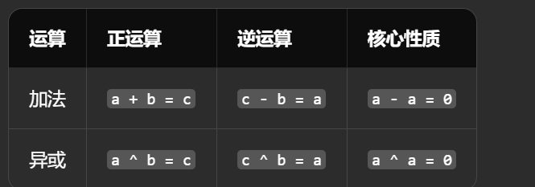

# 笔记与规划

## 规划

**做复合型全栈选手+熟练使用ai**


每日任务

java两小时

题目两小时

## 笔记

### malloc

malloc使用后一定要检查是否分配失败

```c
 if (nums == NULL) { // 必须检查是否分配失败（比如内存不足）        
      printf("内存分配失败！\n");        
      return 1;    
 }
```

### 最大公约数GCD

> 两个数中能同时整除它们的最大正整数

**欧几里得算法（辗转相除法）**

GCD(a, b) = GCD(b, a % b),直到 `b = 0`，此时 `a` 就是最大公约数


**不需要a>b**

**迭代版（更高效，无递归栈开销）**


### 最小公倍数LCM

>最小公倍数 = 两数乘积 ÷ 最大公约数

### 访问

`root->left` 和 `root->right` 是**指针类型**（指向子节点），不能直接相加。

你需要访问它们的 `val` 成员，正确写法是 `root->left->val` 和 `root->right->val`。

`root` 是指针类型，必须用 `->` 访问成员，不能用 `.`。

错误写法：`root.val`，正确写法：`root->val`。

```c
// 边界判断：根节点为空或缺少子节点    
if (root == NULL || root->left == NULL || root->right == NULL) {        
     return false;    
}
```

### XOR异或

**XOR有自己的运算符号^，不用额外定义方法或者函数**


两个值相同则结果为 0，不同则结果为 1

>**自反性**：`a ^ a = 0`（任何数异或自身等于 0）

> **归零性**：`a ^ 0 = a`（任何数异或 0 等于自身）

> **交换律**：`a ^ b = b ^ a`

> **结合律**：`(a ^ b) ^ c = a ^ (b ^ c)`

**2 ^ 4（2 异或 4）详细计算**

1. 第一步：转二进制

   2 的二进制：`010`（3 位，也可写成 `00000010`

   4 的二进制：`100`（3 位，也可写成 `00000100`

2. 第二步：按位异或

对应位相同为 0，不同为 1逐位对比计算：

`    2:  010 ` 

`^  4:  100 `

`    -------- ` 

`结果: 110  （二进制）`c

3. 第三步：转回十进制

二进制 `110` 转十进制：`1×2² + 1×2¹ + 0×2⁰ = 4 + 2 + 0 = 6`



### 绝对值

1️⃣ 使用 `abs()` 函数（最常用，整数）

`abs()` 用于 **int 类型整数的绝对值**，需要包含头文件 `stdlib.h`。

2️⃣ 使用 `fabs()` 函数（浮点数）

如果是 **浮点数（float / double）**，要用 `fabs()`，在 `math.h` 中


### ASCll码

`%c` 就是输出字符。

小写变大写

```
char c = 'a';
c = c - 32;   // 变成'A'
```

大写变小写

```
char c = 'A';
c = c + 32;   // 变成'a'
```

判断数字

```
if(c >= '0' && c <= '9')
```

判断大写字母

```
if(c >= 'A' && c <= 'Z')
```

判断小写字母

```
if(c >= 'a' && c <= 'z')
```

### 丑数（Ugly Number）

一个正整数，如果它的 **质因数只包含 2、3、5**，那么它就是丑数。

1 → 丑数（规定 1 也是）

### 二维数组

2D Array

**初始化**

方法1：完整初始化

```
int a[2][3] = {
    {1,2,3},
    {4,5,6}
};
```

方法2：按顺序初始化

```
int a[2][3] = {1,2,3,4,5,6};
```

方法3：自动计算行数

```
int a[][3] = {
    {1,2,3},
    {4,5,6},
    {7,8,9}
};
```

### 矩阵转置


### 二维数组动态分配

**1️⃣ 方法一：指针数组方式（最常用）**

```c
int **arr;
arr=(int **)malloc(sizeof(int *)*row);//行数
for(int i=0;i<row;i++){
     arr[i]=(int*)malloc(sizeof(int)*col);
}
```

3️⃣ 指针数组 + 连续内存（工程推荐写法）

```c
int**arr;
arr=(int**)malloc(sizeof(int)*row);//指向每一行的指针
int *data=(int*)malloc(sizeof(int)*row*col);
for(int i=0;i<row;i++){//为每一行附上data地址
     arr[i]=data+i*col;//data就是数组首地址
}
```

### 二维数组赋值

`const char* words[] = {"care", "army", "cut"};`c


### 字符要用'呀'

服了。。

### 遇到和是负数但是赋值

赋值为`INT_MIN`是－∞

同样的`INT_MAX`是+∞

### memset

> `memset` 是 **C / C++** 中非常常见的一个函数，用来 **快速给一块内存设置相同的值**

C：`<string.h>`

C++：`<cstring>`

```c
void *memset(void *ptr, int value, size_t num);
```

作用：

> 从 `ptr` 开始的 **num 个字节**，全部设置为 `value`。
>
> `memset` 是一个 **按字节批量填充内存的函数**，最常用于 **初始化数组为 0 或 -1**
>
> 1不行

**为什么 `memset(arr,1,...)` 不对？？？？**

代码：

```
int arr[2];
memset(arr, 1, sizeof(arr));
```

因为 `memset` 按字节填充：

```
每个字节 = 00000001
```

所以内存变成：

```
00000001 00000001 00000001 00000001   -> arr[0]
00000001 00000001 00000001 00000001   -> arr[1]
```

一个 `int` 变成：

```
0x01010101
```

十进制是：

```
16843009
```

所以数组其实是：

```
{16843009, 16843009}
```

而不是：

```
{1,1}
```


BUT

0：00000000 00000000 00000000 00000000

-1：11111111

**在知道数组总字节后，用于数组初始化**

### const

> `const` = 这个值不能被修改

**什么时候用呢？**

✅ 1. 不希望变量被修改（最常见）

✅ 2. 函数参数保护（非常重要）

✅ 3. 指针 + const（重点难点🔥）

### qsort

来自`#include <stdlib.h>`

通用快速排序函数（可以排任意类型）

**函数原型**

`void qsort(void *base, size_t nitems, size_t size,int (*compar)(const void *, const void *));`

| 参数     | 含义                |
| -------- | ------------------- |
| `base`   | 数组起始地址        |
| `nitems` | 元素个数            |
| `size`   | 每个元素大小        |
| `compar` | 比较函数（最重要🔥） |

```c
#include <stdio.h>
#include <stdlib.h>

// 比较函数
int cmp(const void *a, const void *b) {
    return (*(int*)a - *(int*)b);
}//作用：给 qsort 排序用的比较函数，实现升序排序。
//逻辑：若 a 指向的数 < b 指向的数，返回负数，qsort 会把 a 放在 b 前面。

int main() {
    int arr[] = {5, 3, 8, 4, 2};
    int n = 5;

    qsort(arr, n, sizeof(int), cmp);//升序排序

    for (int i = 0; i < n; i++) {
        printf("%d ", arr[i]);
    }
    return 0;
}

```

### *

. 最核心：定义指针变量（声明时）

最常用：解引用（使用时）

语法：`*指针变量` → 拿到指针指向的「真实值 / 内存空间」

### 防止减法溢出

什么是整数溢出？

`\#include <limits.h>`

C/C++ 中 `int` 是**有范围**的：

-  `INT_MAX` = 2¹⁴⁷⁴⁸³⁶⁴⁷（int 最大值）
-  `INT_MIN` = -2¹⁴⁷⁴⁸³⁶⁴⁸（int 最小值）

如果计算结果**超出这个范围**，就会**溢出**，程序得到**错误的负数 / 正数**，直接崩溃

如果算max-min就会溢出，那么

`INT_MAX / 2`：把最大值**缩小一半**，留足计算空间

`INT_MIN / 2`：把最小值**缩小一半**

**目的**：后续做**减法运算**时，结果永远不会超出 int 范围

### 布尔数组直接判断

```
ans[i]=(s[queries[i][1]+1]-s[queries[i][0]])%2==1;
```

直接看等于一为true否则false
